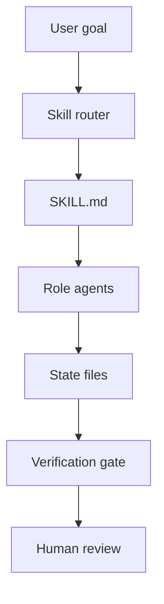

<p align="center">
  
</p>

# skill-jar

[](https://github.com/AP3X-Dev/skill-jar/actions/workflows/audit.yml)

Skill Jar is an **agent skill operating system**: an installable library of
production-grade **Agent Skills** that teach coding agents how to debug,
review, refactor, test, research, and run safe autonomous loops.

Not just reusable prompts. Not just Claude skills. It is an agent operations
layer: a growing set of executable disciplines for getting useful work out of
coding agents without giving up verification, state, or human control.

## Start Here

| If your repo... | Start with | Why |
|---|---|---|
| Is buggy | [**bug-pipeline**](development/bug-pipeline/SKILL.md) | Runs a Hunter -> Fixer -> Validator repair loop over evidence-backed defects. |
| Is messy after feature work | [**optimization-loop**](development/optimization-loop/SKILL.md) | Audits the codebase, builds a measurable backlog, and runs gated improvement cycles. |
| Needs its own recurring agent workflow | [**loop-engineer**](development/loop-engineer/SKILL.md) | Scaffolds the state files, role agents, gates, and driver prompts for a safe loop. |

## How It Runs



Skills turn fuzzy agent work into explicit operating contracts: what to do, what
not to do, which artifacts to update, which gates must pass, and where the human
still owns the decision.

## Self-Hardening by Design

Skill Jar contains the skill that improves Skill Jar.

[**skill-forge**](development/skill-forge/SKILL.md) pressure-tests skills by
watching fresh agents fail, patching the loopholes they found, and re-running
until the behavior holds. This repo also dogfoods that workflow through
`docs/prompts/skill-forge-driver.md`, a jar-wide queue in
`agent-state/SKILL_FORGE_TRACKER.md`, and per-skill run packages under
`agent-state/skill-forge-runs/`. The `jar-audit` loop runs the deterministic
gate, records state under `agent-state/`, and requires a separate checker before
work is marked complete.

That makes the jar a self-hardening skill library: the operating procedures, the
role agents, the state files, and the audit gate all reinforce each other.

## What's an Agent Skill?

Each skill is a self-contained `SKILL.md` (plus any bundled resources) with
frontmatter describing **when** to use it and instructions for **how**. Skills
load on demand — the agent only reads one when the task actually matches, so the
jar can grow without bloating context. The format is portable across any agent
that supports skills.

## Using a skill

Skills are grouped into **categories**, and each category installs as its own Claude Code plugin — so you pull in just the categories you want.

**Claude Code — install the categories you want:**

```
/plugin marketplace add AP3X-Dev/skill-jar
/plugin install skill-jar-development@skill-jar      # the development category
/plugin install skill-jar-systems-design@skill-jar   # the systems-design category
# /plugin install skill-jar-marketing@skill-jar     # (coming soon)
```

Skills then load on demand (`/skill-jar-development:bug-pipeline`, etc.) and update with the repo. There's no all-in-one bundle plugin — install each category you want; it keeps your plugin list clean and avoids copying the whole repo into your cache.

**Any agent — copy the folder** into its skills directory, e.g. in Claude Code:

```
~/.claude/skills/<skill-name>/      # from <category>/<skill-name>/ in this repo
```

Then invoke it by name (`/<skill-name>`) or just describe your task — a capable agent picks the matching skill automatically.

## Skills in the jar

### development

| Skill | What it does |
|-------|--------------|
| [**loop-engineer**](development/loop-engineer/SKILL.md) | Scaffolds a self-running **agent loop** into a repo — automation discovers work, a maker agent executes, a *separate* checker verifies, state is recorded, and the loop decides what runs next. Lays down state files, maker≠checker subagents (Claude Code **and** Codex), trigger + per-cycle driver prompts, runnable verification gates, `AGENTS.md` safety rules, worktree isolation, and install-ready triage / code-review / release role-skills. Agent-agnostic; starts at triage-only and earns autonomy one level at a time. |
| [**bug-pipeline**](development/bug-pipeline/SKILL.md) | A specialized loop for any codebase: a three-agent **Hunter → Fixer → Validator** repair pipeline over a shared `BUG_TRACKER.md`. The hunter files evidence-backed defects (`file:line` + repro, no style nits), the fixer repairs one bug per cycle with the smallest diff that passes the repo gate, and an independent validator — ideally a different model — promotes to `verified` or reopens. Ships the tracker schema, all three agent templates, and the per-cycle driver outline. |
| [**dead-code-reaper**](development/dead-code-reaper/SKILL.md) | A **FUGAZI-native** specialized loop that *safely removes* confirmed-dead code: a Scout runs FUGAZI's dead-code family and proves zero reachability with `trace`, a Reaper deletes one cluster per cycle with the smallest diff, and an independent Validator re-runs FUGAZI + the suite/build against a finding-count/LOC ratchet. Public API and dynamic/reflective usage are blocked for a human call; it never runs `fugazi fix` unattended. Builds and dry-runs the loop, then **offers** launch. |
| [**plan-prune**](development/plan-prune/SKILL.md) | Finds fragmented planning docs, roadmaps, PRPs, specs, handoffs, and state ledgers; reconciles them against current code, git history, and verification output; then updates one canonical plan and reduces the active planning surface by deleting, archiving, or stubbing stale fragments so outdated plans are not floating around. |
| [**sprint-ticket-runner**](development/sprint-ticket-runner/SKILL.md) | A local Linear-style sprint controller for long autonomous development cycles: turns PRPs, PRDs, plans, and user requests into durable `agent-state/sprint/` tickets; keeps board, handoff, decisions, and failed attempts current; runs a first-class **parallelism audit** to classify serial vs. parallel lanes; and enforces worktree isolation plus maker-checker verification so a fresh agent can resume without guessing. |
| [**diagnose-loop**](development/diagnose-loop/SKILL.md) | A **bounded diagnosis loop** for one hard bug or perf regression — reproduce → minimize → seed suspects → fan out **parallel hypotheses** (each made to refute itself) → converge → lock & fix. Optional **FUGAZI** suspect seeding and **MemBerry** root-cause memory help when present; the bundled diagnosis kit makes Superpowers optional, not required. |
| [**design-panel**](development/design-panel/SKILL.md) | **Upgraded brainstorming** for any non-trivial design: parallel exploration agents map the terrain, optional **MemBerry** recalls prior decisions and rejected approaches, a **design-it-twice** rule forces two genuinely different shapes which an independent **judge panel** scores against criteria the human set — the human picks, a **skeptic** grills the winner (failure modes, scale, hidden coupling), and only then is the spec written. Rejected designs are recorded with reasons so they aren't re-proposed at full cost later. |
| [**review-panel**](development/review-panel/SKILL.md) | **Adversarial multi-lens code review**: an optional **FUGAZI** pre-pass grounds the panel, then independent reviewers each work a distinct lens (correctness, security, simplicity/reuse) in parallel, findings are deduped and severity-ranked, and every finding is **verified against the codebase before it's acted on** — no performative agreement. Ships bundled lens templates and the verify-before-act protocol, so Superpowers review skills are optional accelerators. |
| [**optimization-loop**](development/optimization-loop/SKILL.md) | A specialized loop built on `loop-engineer`: audits an existing codebase first (intent discovery → parallel audit → gap analysis), builds a concrete file-level backlog with a measured metric baseline, scaffolds the loop (agent-state spine, dual-mode driver, maker≠checker verifier, no-regression ratchet) — then **wires the trigger and closes cycle 1 before handing off**, so you get a running **audit → fix → measure → track** loop, not a prompt on a shelf. Terminates on CONVERGED / STALLED / DIVERGING over its own metrics. Built for hardening / quality passes after feature work. |
| [**auto-research**](development/auto-research/SKILL.md) | A specialized loop generalizing **Karpathy's autoresearch** pattern to any domain with a runnable metric: the agent runs **fixed-budget experiments** against a frozen eval harness — hypothesize → mutate one file → run → keep/discard by ONE scalar metric → log to `results.tsv` → repeat until interrupted. Builds the harness if the repo lacks one (metric, budget, frozen paths, mutable surface), scaffolds the loop, runs the real baseline, then **offers** launch — the human owns the spend. |
| [**test-backfill-loop**](development/test-backfill-loop/SKILL.md) | A `loop-engineer` loop that **raises coverage one module per cycle**: a Scout finds high-value uncovered code (optional **FUGAZI** `cold-code`/`hot-path`), a maker writes **characterization tests** that pin current behaviour, and a separate verifier confirms each test actually **bites** (goes red when behaviour is perturbed) and that coverage ratchets up — never down. Suspected bugs are filed, never encoded as "expected." Builds + dry-runs, then **offers** launch. |
| [**autonomous-advisor**](development/autonomous-advisor/SKILL.md) | Full hands-off execution: hand it a PRP and it runs the entire pipeline — design → plan → implement → finish → optimize — with zero human input. An **advisor** sub-agent stands in for the human at direction decisions; a separate **verifier** sub-agent gates every work product with evidence and can reject (maker≠checker). Crash-safe via a run-state file with phase-gate evidence and a failed-attempts log; hard guardrails (no prod deploys, no main pushes, no scope creep). |
| [**clean-room**](development/clean-room/SKILL.md) | Reimplement, port, or clone an existing codebase via a firewalled **clean-room rewrite**: multi-pass analysis (AST inventory + 10 analytical passes) produces an exhaustive design doc, an improvements triage, and a PRP — then hands off to `autonomous-advisor` for implementation. Three modes (full clean-room, Parity, Transparent), a mode-locked run-state file so a resumed session can never accidentally breach the firewall, runnable phase gates, and a contamination-scan merge gate. Ships the AST extractor / differ / coverage / contamination scripts. |
| [**improve-architecture**](development/improve-architecture/SKILL.md) | Human-in-the-loop **deep-module refactoring**: find shallow modules, leaky seams, and AI-driven architecture drift, then ship the fix. A strategic human owns direction; the AI explores for friction, presents candidates as a **visual before/after HTML report**, grills the chosen one into a module shape (updating `CONTEXT.md` / ADRs inline), then converts the approved design into an issue and a careful, behaviour-preserving migration. Bundles the deep-module glossary, deepening/testing strategy, design-it-twice interface exploration, and a depth-check → migrate → verify checklist. Run it as a periodic entropy check, not an autonomous pass. |
| [**arch-drift-watch**](development/arch-drift-watch/SKILL.md) | The **detection half of `improve-architecture`**: a scheduled, **FUGAZI**-driven watch that runs `boundaries`/`circular-deps`/`health`/`dupes` read-only, diffs against a committed **baseline**, and files only *new* drift to a triage inbox — routing structural-judgment items to a human review and duplication to `dead-code-reaper`. Detection-only by default (no code writes); trivial auto-fix is earned. Reports the delta, not the backlog. |
| [**skill-forge**](development/skill-forge/SKILL.md) | Automates skill pressure-testing into a loop: **RED** pressure-test a fresh agent *without* the skill and capture the rationalizations it invents, **GREEN** patch the `SKILL.md` to close them, **REFACTOR** re-run until K consecutive clean runs — then a runnable **structure lint** (the jar's own `audit-jar.py`). Optional **MemBerry** grows a cross-skill rationalization corpus; Superpowers writing-skills is optional lineage, not a prerequisite. |

### systems-design

| Skill | What it does |
|-------|--------------|
| [**design-system**](systems-design/design-system/SKILL.md) | The category's **front door**: requirements → SLIs/SLOs + capacity envelope (Little's Law, tail-latency budgets) → the **simplest topology that meets the SLO with headroom**, with the request path, data path, and failure path made explicit — then the operational artifact set (diagram, risk register, dashboards/alerts, canary plan, runbooks, cost notes). Hard **stop-conditions** block premature complexity: no multi-region, mesh, sharding, or polyglot persistence without a named requirement. Bundles defaults-by-scale tables and three case-study topologies. |
| [**api-design**](systems-design/api-design/SKILL.md) | Design an API surface that survives production: protocol by **consumer shape** (HTTP+OpenAPI default, gRPC for internal hot paths, GraphQL only with governance, async events for time-decoupling), then pin the promises — **idempotency keys for anything retried**, deadlines + retry budgets, cursor pagination, additive versioning, one error schema, auth + rate limits, cacheability — and gate releases on backward compatibility. Ships the decision tree and failure-mode playbook (retry storms, duplicate side effects, fan-out tails). |
| [**data-store-selection**](systems-design/data-store-selection/SKILL.md) | **Access-pattern-first** data layer design: write the dominant read/write patterns, name the consistency model per data class, then pick relational (the default) / document / key-value / wide-column / global-SQL — plus partition/shard **key design** (never monotonic, justified against the dominant query), cache policy with explicit invalidation and stampede protection, and queue/stream choice with outbox wiring. Two hard gates: unjustified shard key → reject; unnamed consistency → reject. |
| [**production-readiness**](systems-design/production-readiness/SKILL.md) | The **launch gate**: SLOs + error-budget policy, golden-signal dashboards and symptom-based alerts (bounded cardinality, no PII labels), correct liveness/readiness/startup probes, **runbooks for the five standard failures**, canary + tested rollback, incident roles with safest-reversible-mitigation-first, blameless postmortems, cost as a first-class property. No launch without dashboard URLs, alert routes, a rollback command, and **one executed failure drill**. |

*Twenty skills and counting — the jar fills up over time.*

## For agents

Reading this repo programmatically? Route from [`skills.json`](skills.json) — a generated index of every skill's `name`, routing `description`, and `path` (one fetch, no directory crawl; it's gate-checked against the frontmatter, so it can't drift). Install via the plugin marketplace above (Claude Code) or copy a skill's folder (any host). Every push is verified by `python scripts/audit-jar.py` — the badge above is that gate. If you *operate* in this repo (run a loop cycle, fix a bug), the rules in [`AGENTS.md`](AGENTS.md) bind you.

Development and systems-design skills also ship generated sub-agent packs in [`development/agents/`](development/agents/README.md) and [`systems-design/agents/`](systems-design/agents/README.md). Each pack's `manifest.json` is the source of truth; `python scripts/gen-agent-packs.py` renders copy-ready Claude Code and Codex agent files, and the audit gate verifies they stay in sync. Install only the roles a loop, panel, or design review actually needs.

## Self-Hosted Loop Details

[loop-engineer](development/loop-engineer/SKILL.md) scaffolded a loop system into this very repo (state spine in `agent-state/`, role agents in `.claude/agents/`, drivers in `docs/prompts/`):

- **jar-audit** — keeps the jar publish-ready. Discovery is a deterministic gate, `python scripts/audit-jar.py`: frontmatter parses, descriptions carry triggers, names match directories, every relative link resolves, scripts compile, the scaffolder stays idempotent. Red check → one fix per cycle, verified by a separate agent.
- The repo also dogfoods the [**bug-pipeline**](development/bug-pipeline/SKILL.md) skill on itself — its instance lives in `.claude/agents/` + `docs/prompts/bug-pipeline-driver.md`, tracking to `agent-state/BUG_TRACKER.md`.
- **skill-forge** — works through `agent-state/SKILL_FORGE_TRACKER.md` until every skill has RED pressure evidence, a focused GREEN patch when needed, 3/3 clean judge runs, and the audit gate green. Run packages live in `agent-state/skill-forge-runs/`; the driver is `docs/prompts/skill-forge-driver.md`.

Run a cycle by handing your agent the matching driver in `docs/prompts/`. All three loops run at autonomy Level 2: they commit locally; a human reviews and pushes.
