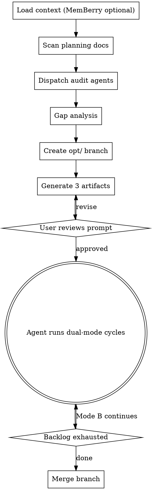

# Building Optimization Loop Prompts

Produce a concrete, self-sustaining optimization prompt for any codebase. The prompt guides an agent through repeated cycles of improvement — fixing known issues, discovering new ones, and tracking progress across session restarts.

**Output:** Three artifacts — an optimizer prompt (the execution guide), a progress log (restart memory), and optionally an intent summary (synthesized from scattered planning docs).

**Core principle:** Audit first, then optimize. Never write a generic optimization prompt based on assumptions. Discover what THIS codebase needs through structured investigation.

## Persistence — what's required vs. optional

The progress-log file is the **REQUIRED** restart mechanism; the loop works with nothing else. **MemBerry** (a Neo4j knowledge-graph MCP server) is an **OPTIONAL adapter** that adds cross-session learning. If no MemBerry tools are present in your environment, skip every step labelled **(MemBerry)** and rely on the log alone — the loop is fully functional without it.

## Two layers — read this before you start

This skill operates on two layers. Keep them straight:

1. **Layer 1 (the process YOU run now)** — auditing, gap analysis, generating artifacts. You perform these steps.
2. **Layer 2 (text that goes INTO the optimizer prompt)** — everything inside the Artifact 1/2/3 template fences. You *author* this text; you do not perform it. A separate loop-agent runs it later, session after session.

When a template below reads in the imperative ("Run the suite", "Commit"), that's layer-2 — written for the future loop-agent, not for you now.

## MemBerry Integration (optional adapter)

The optimization loop works on two persistence layers:

- **Progress log** (file) — session-by-session punch list. Simple, diff-friendly, readable in any editor. The restart mechanism. **Required.**
- **MemBerry** (knowledge graph) — structured knowledge about *why* things were done, what patterns emerged, what conventions were established. The learning mechanism. **Optional** — skip if unavailable.

The progress log tracks *what's done*. MemBerry remembers *what was learned*.

**During prompt generation (this skill):** If MemBerry is available, load its context first. Prior optimization work, known issues, architectural decisions, and codebase conventions from past sessions all inform the audit and backlog.

**In the generated optimizer prompt:** The agent running the loop uses MemBerry each session to load context before working and store findings after working. MemBerry's memory tiers map naturally to the optimization loop:

| MemBerry Tier | Optimization Use |
|----------|-----------------|
| **Core: `current_objective`** | Current backlog focus + overall optimization goal |
| **Core: `project_state`** | High-level health scores, completion %, key patterns, metric vector |
| **Working: `working_state`** | Current session's Mode A item + Mode B discoveries |
| **Working: `open_questions`** | Ambiguities found during this session |
| **Archive (berry_store)** | Each session's decisions, fixes, root causes, conventions |

## Git Versioning

Every optimization loop runs on its own branch. This gives you isolation (abandon the whole pass if it goes sideways), a clean merge point, and reviewable history.

**Branch:** Created once during artifact generation. Named `opt/<project>-<focus>`.
**Commits:** One per session, after all fixes are done and tests pass. The commit bundles Mode A + Mode B work together — the session is the atomic unit, not the individual fix.
**Merge:** When the backlog is exhausted or the user decides the pass is done.
**Staying current:** If the branch tracks an active integration branch (one others are merging into), sync each session and re-merge periodically rather than letting one branch drift for an entire multi-session pass — long-lived branches accumulate zombie conflicts where fixes were applied to a stale snapshot. A solo or local-only pass can skip this.

```
opt/oni-core-hardening
  ├── opt(1): wire config through SwarmRunner + 2 discovery fixes
  ├── opt(2): fix silent error swallowing in api handler + 1 discovery fix
  ├── opt(3): add missing null checks on swarm input
  └── ... (merge to main/dev when done)
```

## When to Use

- Codebase has completed a feature sprint and needs hardening/polish
- Shifting from "build" mode to "improve" mode
- Want an agent to continuously find and fix bugs, dead code, performance issues, wiring gaps
- Multiple planning documents exist that may be incomplete, contradictory, or stale
- Previous optimization work was done but no one tracked what's finished vs. remaining

## When NOT to Use

- Codebase is brand new (nothing to optimize yet — use brainstorming/writing-plans instead)
- Single specific bug to fix (just fix it — this skill is for ongoing loops)
- User wants a feature built (this is optimization, not feature development)

## The Process



---

## Phase 0 (optional): Load MemBerry Context

**If MemBerry is available,** load existing knowledge about this codebase before anything else. If it isn't, skip this phase entirely and proceed to Phase 1.

1. **Check for MemBerry Memory config** in the project's CLAUDE.md.
2. **Call `berry_load`** with the optimization task:
   ```
   berry_load(task: "optimization loop: audit and improve codebase", tags: ["project:<tag>"], max_tokens: 4000)
   ```
3. **Check for prior optimization work** — past sessions may have already audited dimensions, established conventions, or identified patterns. Don't rediscover what's already known.
4. If MemBerry is present but the project has no config, invoke the `memberry-setup` skill (the MemBerry setup skill) to bootstrap it. If MemBerry is absent, skip this phase.

Use loaded context to skip re-auditing areas that are already well-understood and to inform the backlog with known issues.

---

## Phase 1: Intent Discovery

Before reading code, find out what the codebase is *supposed to be*. Scan for planning documents AND MemBerry knowledge:

**Where to look:**
- **MemBerry first** (if available) — `berry_load` results may already contain synthesized intent, architectural decisions, and past audit findings
- `docs/plans/`, `docs/specs/`, `docs/prompts/`, `docs/superpowers/specs/`
- `CLAUDE.md`, `AGENTS.md`, `MEMORY.md`, `README.md`, `ARCHITECTURE.md`
- Any `*.plan.md`, `*.spec.md`, `*.design.md`
- Auto-memory directories (`.claude/projects/*/memory/`)
- Recent git log (`git log --oneline -30`) for stated goals in commit messages

**What to extract from each document:**
- Stated goal / desired end state
- Feature list or task list with any completion markers
- Items marked TODO, FUTURE, PHASE N, BACKLOG
- Architectural decisions and constraints
- Contradictions with other documents (plan A says X, plan B says Y)

**Synthesize into one answer:** "What is this codebase trying to become?"

This is the north star. Without it, the agent optimizes blind — it can't distinguish "dead code that should be deleted" from "unfinished feature that should be completed."

**If planning documents are fragmented or contradictory:** Flag contradictions for the user. Generate an Intent Summary artifact (see Phase 4).

---

## Phase 2: Codebase Audit

Dispatch parallel exploration agents. **Do not use predefined dimensions** — discover what matters for THIS codebase.

### Agent Dispatch Template

Launch 4-6 agents in parallel. Adapt the focus areas to the codebase type:

**Agent 1 — Architecture & Structure**
> "Read the entry points, module boundaries, and dependency graph of this codebase. How do modules communicate? Are there circular dependencies? Where are the seams between subsystems? Compare against the intended architecture: [paste intent summary]. Report: what's well-structured, what's tangled, what's missing."

**Agent 2 — Test Health**
> "Run the test suite. Report: total tests, pass rate, any failures (with error messages), flaky tests (run twice if needed), slowest tests (>2s). Check coverage if tooling exists. Identify modules with zero test coverage — flag these as 'fix-requires-test-first' so any backlog item touching them carries that constraint. Report which planned features lack tests."

**Agent 3 — Wiring & Integration**
> "Pick 3-5 key data paths through the codebase (e.g., user input → processing → output, config loading → module consumption, event emission → event handling). Trace each end-to-end. Report: where does data flow correctly? Where are disconnections (module produces output nobody consumes, config parsed but never used, events emitted with no subscribers)?"

**Agent 4 — Code Quality**
> "Scan for: dead code (unused exports, unreachable functions), inconsistent error handling patterns, type safety gaps (any types, missing null checks), hardcoded values that should be configurable, missing input validation at system boundaries, unhandled promise rejections. Report findings with file paths and line numbers."

**Agent 5 — Build & Config** (if applicable)
> "Check: build pipeline health, dependency versions (outdated? vulnerable?), configuration completeness (are all config fields consumed?), environment handling (dev/prod differences), CI/CD if present. Report gaps."

**Adapt to the codebase.** A frontend app needs a "UI/UX agent" checking accessibility, responsive behavior, bundle size. A CLI needs a "shell compat agent." An API needs an "endpoint coverage agent." Choose agents that match what the codebase IS, not a generic checklist.

### Score Each Dimension

From the agent reports, identify 5-8 natural dimensions for this codebase. For each:
- **Name it** (test health, wiring completeness, error handling, etc.)
- **Score it** (what % is solid vs. needs work)
- **List concrete findings** (specific files, specific problems)
- **Record a re-runnable measurement recipe** — the exact command and current number THIS codebase's tooling produces (e.g. test pass count, `tsc --noEmit` error count, coverage %, lint warning count, bundle bytes, a key benchmark). Detect what this toolchain actually offers; if a dimension has no cheap measurement, write "n/a — no tooling" and keep it qualitative. **Do not invent tooling or assume a fixed metric list** — this stays codebase-derived, like everything else. This baseline vector is the loop's *setpoint*: it gets re-measured every session and ratcheted so the loop can tell improvement from churn.

### Store Audit Findings (MemBerry, if available)

If MemBerry is present, store the baseline audit as a session record (skip this subsection entirely if not):
```
berry_store(
  session_id: "<id>",
  task: "[project:<tag>] optimization audit: baseline dimensions scored",
  content: "[project:<tag>] Baseline audit complete. Dimensions: <list with scores>. Metric vector: <baseline numbers>. Top priorities: <top 3>. Architecture: <brief>. Key patterns found: <patterns>.",
  outcome: "approved",
  entities: ["<project>", "<key-modules-found>"]
)
```

Also update the core project state block:
```
berry_memory_insert(block: "project_state", scope: "project:<tag>",
  text: "Optimization loop initiated. Baseline: <dimension scores + metric vector>. Backlog: N items.")
```

This ensures future sessions (and other agents) know what was audited, what the baseline was, and what the priorities are — even if they don't read the progress log file.

---

## Phase 3: Gap Analysis

Compare intent (Phase 1) against reality (Phase 2). Classify every finding:

| Classification | Meaning | Priority |
|---|---|---|
| **In plan, not implemented** | Unfinished work from a planning doc | High — planned but missing |
| **In plan + implemented, not wired** | Feature exists but doesn't reach its consumer | High — dead wire |
| **Implemented, not in any plan** | Organic addition — may be useful or cruft | Medium — verify with user |
| **In multiple plans, conflicting** | Documents disagree on approach | Block — needs user decision |
| **Implemented, contradicts plan** | Code drifted from design intent | Medium — fix or update plan |
| **Verified complete** | Working, tested, wired end-to-end | Done — add to "already done" list |

**Estimate cycle count:** For each non-done classification, estimate how many sessions it needs. Total gives the expected loop duration. Be specific — "~20 sessions" is useful, "many sessions" is not.

**Treat destructive findings as claims, not facts.** Gap-analysis classifications assume the audit finding is true. Auditor assertions of "dead code", "unused config", or "no subscriber" are frequently wrong — code is often loaded via reflection, dynamic import, or string-keyed registries. Mark any remove/delete/disconnected finding as a *candidate to confirm*, and require reproduction evidence before the loop-agent acts on it (see the Evidence and Confirm-before-destroying rules in Artifact 1).

---

## Phase 4: Create Branch & Generate Artifacts

### Create the optimization branch

Before writing artifacts, create the branch the loop will run on:

```
git checkout -b opt/<project>-<focus>
```

Pick `<focus>` based on what the audit found — `hardening`, `quality-pass`, `wiring-fixes`, `test-coverage`, etc. Keep it short and descriptive. This branch lives for the duration of the loop.

Record the branch name in the optimizer prompt and progress log so every session knows where to work.

### Artifact 1: Optimizer Prompt

Write to `docs/prompts/<name>-optimizer.md`. Structure:

```markdown
# <Name> — Continuous Optimizer

<1-2 sentence identity: what the agent is, what codebase it optimizes>

## Intent Summary
<2-3 paragraphs: what the codebase is trying to become, synthesized from planning docs>

## Already Done — Do Not Re-Audit
<Bulleted list of verified-complete areas with evidence. Prevents wasted cycles.>
<An area stays on this list only until code in it changes — if a session modifies a listed area, drop it back into the backlog for re-verification.>

## Backlog — Ordered by Priority (descending)
<Within a tier, planned-missing and dead-wire items rank above cleanup; ties keep audit-discovery order.>
### Block 1: <Category> (N items)
#### Item 1: <Title>
**Priority:** High | Medium | Block
**Problem:** <What's wrong, concretely>
**Files:** <Exact files to read>
**Evidence:** <Required for any remove/delete/unused/no-consumer/disconnected claim: the grep/trace/failing test that proves it. Optional for additive fixes.>
**Fix:** <What to do>
**Acceptance:** <Falsifiable check — a command that exits 0, OR a specific assertion/trace that must now hold>

<...more items...>

## Discovery Guidance
<Codebase-specific hints for exploratory Mode B work:>
- What patterns to look for in this codebase
- What integration paths to trace
- What quality standards apply
- What tools to run (linters, type checkers, test suites, and any static-analysis / dead-code / dependency-audit tooling this repo already supports — capture each as a metric command so its count can ratchet down over the loop)
- **The Mode B discovery sweep** (reuse the Agent-4 code-quality criteria from the audit): dead code, unused imports/exports, inconsistent error handling, missing edge cases, type-safety gaps, performance issues, unhandled rejections, hardcoded values, wiring disconnections. Run the suite, linters, and type checkers — investigate warnings, not just errors. Trace integration paths end-to-end.
- **Discovery protocol:** small fix (< 15 min, adjacent to current work) → fix now, log as a "Discovery fix". Larger find → add to backlog with description, files, priority, and source ("discovered while fixing Item #7"). Only persist a NEW item if it clears the significance bar (see Rules).

## When to Stop and Ask the Human
Halt the current item and log it (do not proceed) when:
- The item conflicts with the Intent Summary, or two planning docs disagree on the approach.
- The fix would change a public API, schema, config contract, or on-disk format.
- You would delete or rewire code referenced outside its own module.
- Tests can only pass by changing their expectations, with no intent-doc justification.
- The item is clearly multi-session in scope.
- The intended behaviour is genuinely ambiguous.

Heuristic: **expensive-to-reverse guess → stop and ask; cheap-and-obvious → proceed and log.** A halt writes the item to the "Blocked — Needs User Decision" table in the progress log (and to `open_questions` if MemBerry is available), then skips it and continues other work.
<The generating agent should specialize this list with the specific public APIs, formats, and cross-module exports found during the audit.>

## Session Workflow (the loop-agent runs this each session)
1. **Git + recovery preflight** — checkout the opt branch. Run `git status`; if the tree is dirty from a crashed prior session, recover the in-flight item (read `working_state` if MemBerry, else the log's last entry), then EITHER finish it from the partial diff OR `git stash` / `git checkout .` back to the last good commit — log the recovery action either way. **Sync (only if the branch tracks an active integration branch):** `git fetch <remote> && git <merge|rebase> <remote>/<branch>` — the generator fills in remote/branch and merge-vs-rebase from the repo's convention; resolve conflicts now and note them. If the branch has drifted past the divergence threshold set at generation time, STOP and ask the user to merge before continuing. Skip sync entirely for a local-only pass.
2. **(MemBerry) Load** — `berry_load(task: "optimization session N: <next item title>", tags: ["project:<tag>"])`. Check for conventions, past decisions, known gotchas relevant to this item.
3. **(MemBerry) Set working state** — `berry_memory_insert(block: "working_state", scope: "project:<tag>", session_id: "<id>", text: "Session N: working on Item #X — <title>")`.
4. **Read progress log** — find the next item. The log is authoritative for *what's next* (confirm alignment with any MemBerry context, but never trust a MemBerry "done" marker that lacks a commit SHA in the log).
5. **Mode A:** Execute the next backlog item (read files → implement fix → verify its Acceptance check).
6. **Mode B:** Run the discovery sweep per **Discovery Guidance** above — flag genuine defects only. A clean sweep ("nothing met the bar") is a valid, successful session — never manufacture work.
7. **Verify + re-measure.** Run the full verification suite (it must actually execute and report a real test count — an empty/missing/erroring suite is a STOP-and-report, never a pass). Re-run the dimension measurement commands; record each current value plus its delta vs. last session and vs. baseline. **Gate:** all tests pass AND no ratcheted metric is below its recorded floor.
8. **Update progress log** — append the session entry (including the metrics line) and update the status block. Do this BEFORE committing.
9. **Git commit — code and log together:**
   ```
   git add <all changed files + the progress log>
   git commit -m "opt(N): <backlog item title> + M discovery fixes

   Backlog #X. <one-line root cause or summary>.
   Discovery: <brief list of Mode B fixes, if any>."
   ```
   Committing the log update in the same commit means a restart never sees a committed-but-unlogged item. If tests don't pass or a ratcheted metric regressed without a logged waiver, do not commit — fix or revert until the gate is green.
10. **(MemBerry) Store + cleanup** — store the session's decisions, root causes, and conventions; then update `project_state` with the new completion % and metric vector, archive `working_state`, and promote any still-relevant `open_questions` to core:
    ```
    berry_store(
      session_id: "<id>",
      task: "[project:<tag>] optimization session N: <item title>",
      content: "[project:<tag>] Fixed <what> (<short sha>). Root cause: <why>. Convention established: <if any>. Discovered: <Mode B findings>.",
      outcome: "approved",
      entities: ["<affected-modules>"]
    )
    ```
11. **(MemBerry) Signal if applicable** — if a fix confirmed or contradicted existing MemBerry knowledge, include signals in the store call. **If MemBerry is unavailable this session, skip steps 2-3 and 10-11 and mark the session entry "MemBerry: UNAVAILABLE".**

## Rules
- **One backlog item in flight per session** (Mode A) — finish it or explicitly carry it over. If an item is bigger than a session, split it into sub-items, complete one, and mark the parent IN PROGRESS. Never mark COMPLETED unless fully done and verified. Unlimited discovery fixes (Mode B).
- **Scope discipline** — change code only to fix a real, observed defect or a backlog item, with the smallest diff that works. No drive-by renames, reformatting, or restructuring. Treat suppressions, `eslint-disable`, `// intentional` comments, and unusual-but-working code as deliberate: log them to `open_questions`, don't silently "fix" them.
- **Evidence** — every *discovered* backlog item cites an exact `file:line` plus an observable symptom or one-line repro. No hypotheses in the fix queue; unconfirmed suspicions go to `open_questions` for verification.
- **Confirm before destroying** — before deleting code or rewiring a claimed disconnection, reproduce the claim: re-grep for the symbol INCLUDING dynamic/string/reflection references (registries, DI containers, dynamic import, config-keyed lookups). If you cannot reproduce that no consumer exists, mark the item "unconfirmed — needs investigation" and skip it. Never delete on an auditor's word alone.
- **Test integrity** — never weaken, skip (`.skip`/`xit`), delete, or loosen an existing test to make the suite pass; a genuinely-wrong test is a logged, justified backlog item, not a silent edit. If a correct fix breaks a test, the test is suspect — verify which one encodes the right behaviour; do not revert a correct fix to appease a wrong test. The verification suite must actually run and report a real test count — an empty/missing/erroring suite is a STOP-and-report, never a pass.
- **Significance bar** — in Mode B, only log or fix a genuine defect, a correctness/wiring/security/data-integrity risk, or a measurable improvement. Style, taste, consistency-renaming, and speculative defensive hardening do NOT qualify. "Found nothing meeting the bar" is a successful session.
- **No-regression ratchet** — re-measured metrics may not regress vs. their running best floor (improvement metrics up only, cost metrics down only), even when all tests pass. A regression must be fixed before commit OR committed with a one-line waiver in the session entry stating why (e.g. "deleted 3 tests for a removed dead module — intentional"). Advance the floor on improvement.
- **Plan conflicts are never resolved by guessing** — Block-classified ambiguities and intent conflicts go to the "Blocked — Needs User Decision" table (+ `open_questions` if MemBerry); skip them and continue other work.
- **TDD where practical** — prefer a failing test before a fix, especially for behavioural changes and any module flagged "fix-requires-test-first".
- **Git** — commit the progress-log update together with the code, one commit per session, only when the gate is green. Never commit a broken state.
- **(MemBerry, if available)** — load at start, store at end; update `working_state` during the session for crash recovery. The loop runs fine without it; the progress log is the source of truth for loop state.
- <Add codebase-specific rules: git safety, test excludes, dependency constraints, etc.>
```

### Artifact 2: Progress Log

Write to `docs/prompts/<name>-optimizer-log.md`:

```markdown
# <Name> Optimizer — Progress Log

## Status
- **Branch:** opt/<project>-<focus>
- **Total backlog items:** N
- **Completed:** 0
- **Discovered during optimization:** 0
- **Next item:** #1 — <title>
- **Baseline (commit/date):** <metric>=<v>, <metric>=<v> ...  <the audit's measurement vector — the loop's setpoint>
- **Ratchet high-water marks:** <metric>=<best>, <metric>=<best> ...  <updated when a metric improves; never allowed to regress past these>

## Completed Items
| # | Item | Date | Session | Commit | Notes |
|---|------|------|---------|--------|-------|

## Discovered Items
| # | Item | Discovered While | Priority | Added As |
|---|------|-----------------|----------|----------|

## Blocked — Needs User Decision
| # | Item | Conflict / Question | Raised (session) | Status |
|---|------|---------------------|------------------|--------|

## Session History
<!-- Each session appends an entry here -->
```

### Artifact 3: Intent Summary (if needed)

Write to `docs/prompts/<name>-intent-summary.md` ONLY if planning documents were fragmented or contradictory:

```markdown
# <Name> — Intent Summary

## Synthesized Goal
<What the codebase is trying to become — one coherent narrative>

## Source Documents
| Document | Status | Key Goals | Notes |
|----------|--------|-----------|-------|

## Contradictions
| Topic | Doc A Says | Doc B Says | Resolution |
|-------|-----------|-----------|------------|

## Completion Matrix
| Planned Feature | Status | Evidence |
|----------------|--------|----------|
```

### Before handoff — verify the optimizer prompt

Run this gate on your own output before presenting artifacts at the "User reviews prompt" step. If any item fails, fix it first.

- [ ] Every backlog item names exact files, a concrete fix, and a falsifiable Acceptance check — no "improve X".
- [ ] Dimensions AND their measurement recipes were derived from the audit, not a generic checklist.
- [ ] "Already Done — Do Not Re-Audit" is non-empty (proves the audit actually ran).
- [ ] The `opt/` branch was created, and its name appears in both the optimizer prompt and the progress log.
- [ ] The progress log's Status block carries the baseline metric vector.
- [ ] An Intent Summary exists if and only if planning docs were fragmented or contradictory.

---

## The Dual-Mode Cycle

This is the canonical description of the cycle (skill-internal — the loop-agent reads its operational version from the optimizer prompt's Session Workflow + Discovery Guidance). The generated prompt structures each agent session as:

**Mode A (Structured):** Execute the next backlog item. This is predictable, measurable progress through known issues.

**Mode B (Exploratory):** After the backlog item, proactively investigate:
- Run the test suite — investigate failures, flaky tests, slow tests
- Read code adjacent to what was just fixed (while it's in context)
- **Reflect on the fix just made** — state in ONE sentence the assumption it relied on and what nearby code shares that assumption; this names the files to investigate next. (If it yields no concrete file/symbol lead, skip it — don't narrate.)
- Check for: dead code, unused imports/exports, inconsistent error handling, missing edge cases, type safety gaps, performance issues, unhandled rejections, hardcoded values
- Run linters and type checkers — investigate warnings, not just errors
- Trace integration paths end-to-end — does module A's output reach module B?

**Discovery protocol:**
- Small fix (< 15 min, adjacent to current work) → fix now, log as "Discovery fix"
- Larger issue → add to backlog with: description, affected files, priority, source ("discovered while fixing Item #7")
- **Admission floor:** only persist a NEW backlog item if it is impact ≥ Medium or it moves a tracked metric/dimension. Below that bar is fix-now-or-skip. Stale low-impact items the loop keeps passing over get archived, not carried forever.
- The backlog grows AND shrinks — this is correct. New discoveries are real work.

**When original backlog is exhausted:** Shift to pure Mode B. The agent is now self-directed — assess, discover, fix, log, repeat. The progress log continues tracking everything.

**Termination conditions.** With the metric vector in place, the stop signal is no longer pure vibes — it's expressed over what the log already records (per-session new High+ items, open High/Block count, the tracked metrics):

- **CONVERGED** → stop, run the final suite, merge. Over the last ~3 sessions: no new High+ items admitted, the open High/Block backlog is empty, and tracked metrics are flat within a per-metric epsilon set in the prompt (e.g., if applicable: coverage < 0.5%, bundle < 1%).
- **STALLED** → escalate to the user. Metrics and discoveries have gone flat but High/Block items remain — the loop can't make progress on its own.
- **DIVERGING** → halt immediately, even with green tests. A tracked metric regressed across 2+ sessions; root-cause it before doing anything else.

**When the loop is done** (CONVERGED, or the user calls it "good enough"):

1. Run the full test suite one final time on the `opt/` branch, and re-measure the metric vector for the final report.
2. Review the branch diff against main: `git diff main...opt/<project>-<focus> --stat`.
3. Roll up the "Blocked — Needs User Decision" table into the merge summary so nothing decided-by-default slips through review.
4. **(MemBerry, if available)** store a final summary:
   ```
   berry_store(
     task: "[project:<tag>] optimization loop complete",
     content: "[project:<tag>] Optimization pass finished. N sessions, M backlog items completed, K discoveries fixed. Metrics: <baseline → final>. Key patterns: <...>. Remaining: <if any>.",
     outcome: "approved"
   )
   ```
5. Merge the branch. Use `/finishing-a-development-branch` for structured options (merge, squash, PR).

---

## Progress Log Protocol

The progress log is what makes the loop **restartable**; MemBerry, when present, is what makes it *learnable*. The log is **authoritative for loop STATE** (completed items, next item, commit SHAs, the metric vector); MemBerry is authoritative for **KNOWLEDGE** (root causes, conventions, patterns). On any disagreement about state, trust the log and correct MemBerry — and never trust a MemBerry completion marker that lacks a commit SHA in the log.

Every session appends an entry to the log after work is done:

```markdown
### Session N — YYYY-MM-DD
- **Commit:** `<short sha>` opt(N): <message>
- **Backlog item:** #X — <title> — COMPLETED / IN PROGRESS / SKIPPED (reason)
- **Mode B discoveries:** <count> (<brief descriptions>)
- **Discovery fixes:** <count> fixed inline
- **New backlog items:** <count> added (#Y, #Z)
- **Test results:** N/N pass, types clean / issues found
- **Metrics (vs last / vs baseline):** <metric>: <prev>→<curr>, <metric>: <prev>→<curr> ...  <note any ratchet waiver here>
- **Observations:** <anything notable for future sessions>
- **MemBerry:** stored / UNAVAILABLE
- **Next session starts at:** Item #X+1 / Continue #X / Mode B only
```

Then update the status block at the top of the log (total, completed, discovered, next, ratchet high-water marks).

The per-session MemBerry load / store / cleanup steps are specified once, in the optimizer prompt's Session Workflow (steps 2-3, 10-11) — they are not restated here. The one rule worth repeating: a MemBerry store captures what the log *doesn't* — root causes, conventions, architectural patterns, and signals against prior knowledge — never a paste of the log entry.

If the loop restarts with a fresh agent, the new agent reads the log for *what's next* and (if MemBerry is present) loads it for *how to approach it*. The log alone is sufficient to continue.

---

## Common Mistakes

**Writing generic prompts without auditing first.** "Improve performance and code quality" is useless. "Item 3: Wire searchEndpoint config from ONICodeConfig.swarm through bin.ts to DefaultSwarmRunner constructor" is actionable.

**Skipping intent discovery.** Without planning docs, the agent can't distinguish dead code from unfinished features. Every "dead wire" it finds might be a TODO, not a bug.

**Fixed backlog with no discovery mode.** A punch list only covers what the initial audit found. Codebases have issues that only surface when you fix adjacent code. Mode B catches these.

**No progress log.** Without persistent state, a restarted loop re-audits completed work, repeats fixes, and loses discovered items. The log takes 2 minutes to write and saves hours.

**Predefined dimensions.** "Check swarm effectiveness" is meaningless for a React app. Let the audit discover what dimensions matter for THIS codebase — including which metrics it can actually measure.

**Measuring once, then flying blind.** Scoring dimensions at audit time but never re-measuring turns the loop open-loop: quality can erode while tests stay green. Capture a re-runnable metric vector and ratchet it every session.

**Generating items without exact files and fix instructions.** "Improve error handling" isn't an item. "In src/api/handler.ts, the catch block on line 47 swallows errors silently — log and rethrow" is an item.

**Acting on auditor claims without confirming.** "Dead code" and "no subscriber" findings are routinely wrong (reflection, dynamic import, registries). Reproduce destructive claims before deleting — or skip the item.

**Duplicating the progress log in MemBerry stores.** The progress log tracks *what's done*. MemBerry stores track *what was learned* — root causes, conventions, patterns, tradeoffs. Don't paste the log entry into `berry_store`. Store the reasoning and decisions that the log doesn't capture.

**Skipping MemBerry load on restart (when it's available).** A fresh agent that only reads the progress log knows *what to do next* but not *how to approach it*. MemBerry context carries conventions, past mistakes, and architectural decisions that prevent repeated errors. When present, load both.
