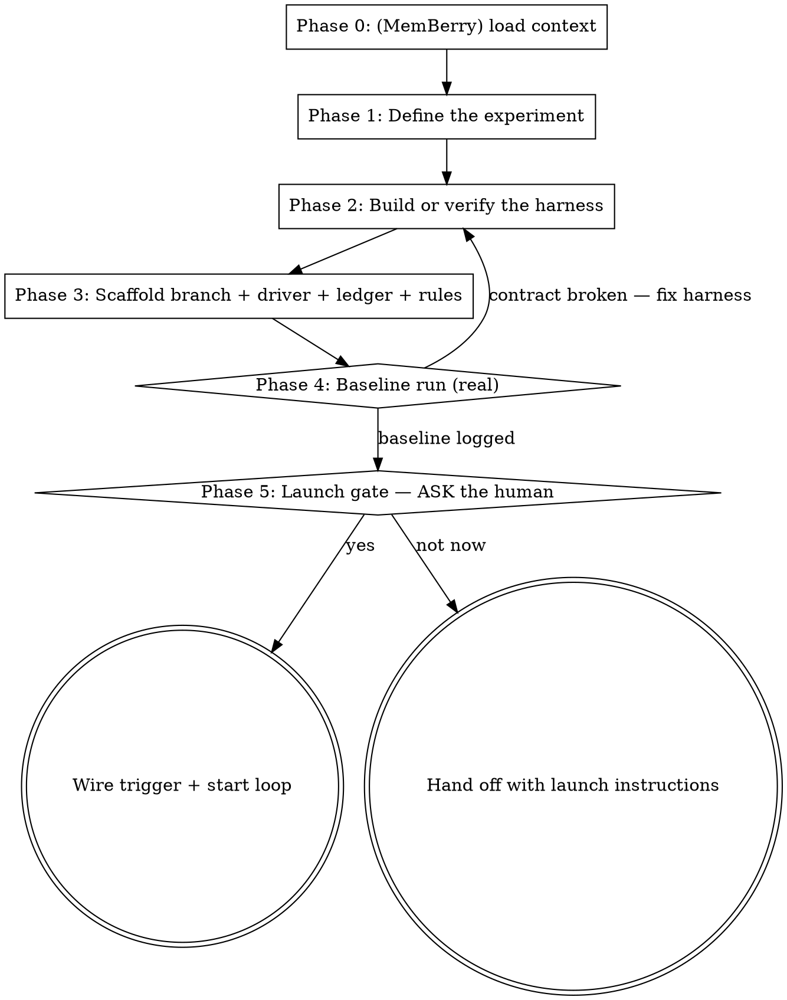

# Auto-Research

Build a **Karpathy-style auto-research loop**: an agent runs fixed-budget
experiments against a frozen evaluation harness, chasing ONE scalar metric —
hypothesize → mutate the experiment surface → run → keep or discard by the
metric → log → repeat until the human interrupts. The pattern comes from
Karpathy's [autoresearch](https://github.com/karpathy/autoresearch) repo (a
nanochat-derived training speedrun: the agent edits `train.py` overnight
chasing lower `val_bpb`); this skill generalizes it to any domain where one
command can produce the number: model training, prompt optimization,
algorithm performance, compression, benchmark scores.

This is the jar's third **specialized loop built on
[loop-engineer](../loop-engineer/SKILL.md)** conventions, alongside
[optimization-loop](../optimization-loop/SKILL.md) and
[bug-pipeline](../bug-pipeline/SKILL.md).

**Output:** a loop scaffolded into the target repo — a `research/<tag>`
branch, a specialized driver at `docs/prompts/<tag>-research-driver.md`, an
untracked `results.tsv` ledger + `experiment-state.md`, research rules in
`AGENTS.md`, a **real baseline run already logged** — and then a launch
**offer**. Never an auto-launched loop.

**Two core principles:**

1. **One number, one surface, everything else frozen.** The loop optimizes
   exactly one scalar, edits (ideally) one file, and treats the harness as
   read-only ground truth. Every loosening of those three multiplies the ways
   the loop can fool itself.
2. **The human owns the launch.** Experiments spend real compute. Build
   everything, prove the harness with a baseline, present the cost per cycle —
   then ask.

## How the six-part spine specializes for research

| Spine stage | Auto-research form |
|---|---|
| **Trigger** | Offered at the launch gate (run-now in session, `/loop`, or local cron) — never wired silently |
| **Discovery** | The ledger: the last ~20 rows of `results.tsv` — what worked, crashed, plateaued |
| **Planning** | ONE hypothesis per cycle, informed by the ledger |
| **Execution** | Mutate the experiment surface, commit, run the harness at the fixed budget |
| **Verification** | The frozen harness IS the checker (see below), plus the frozen-paths integrity gate |
| **State update** | One TSV row per experiment; the branch advances (keep) or resets (discard) |

## Two layers

Same convention as the sibling skills. **Layer 1** is what YOU do now: define
the experiment, build/verify the harness, scaffold, run the baseline, offer
launch. **Layer 2** is text you author for the future loop-agent — everything
inside the template fences in
[references/driver-template.md](references/driver-template.md). Imperative
sentences there address that agent, not you.

## Where the state lives — and why it's untracked

This loop deliberately does NOT use the full `agent-state/` spine. The pattern
carries its own state, minimally:

- **`results.tsv`** is the ledger — completed work and failed attempts in one
  append-only table.
- **The git branch** is the keep/discard memory — advance on improvement,
  `git reset --hard` on regression.
- **`experiment-state.md`** (~15 lines) is the cold-restart anchor: objective,
  run command, budget, frozen paths + freeze commit, baseline, current best.

`results.tsv`, `experiment-state.md`, and `run.log` stay **untracked and
gitignored**. That is what makes discard-by-reset safe: the ledger survives
every reset, and experiment commits contain only the surface change.

**Honest limitation:** because the ledger lives only in the working tree, this
loop runs **in-session or on the local machine** (cron + headless CLI). Cloud
Routines clone fresh from the default branch and would see neither ledger nor
state. This deviates from loop-engineer's commit-state-with-code rule
deliberately; do not "fix" it by committing the ledger — that breaks reset
semantics.

## Maker≠checker, adapted

The jar's rule exists so no agent grades its own work. In this loop the grader
is the **frozen harness**: an objective, deterministic command whose verdict
the agent cannot argue with — plus an integrity gate proving the harness
wasn't touched (`git diff` over the frozen paths against the freeze commit
must be empty, every cycle). A second verifier agent would add cost without
rigor when the verdict is a number printed by frozen code. This adaptation is
designed, not forgotten.

## When to Use

- The user wants an agent experimenting unattended (overnight) to push one
  measurable number: training loss, eval accuracy, ops/sec, bytes, latency.
- The user mentions Karpathy's autoresearch, "speedrun", or wants the
  hypothesize→run→keep/discard pattern on their own problem.
- A repo has (or can get) a command that produces a scalar metric under a
  fixed budget.

## When NOT to Use

- Multi-metric quality/correctness hardening on an existing codebase — use
  **optimization-loop** (backlog + ratchet, not keep/discard).
- Finding and fixing defects — use **bug-pipeline**.
- No runnable metric exists and none can be built (taste, design, UX) — there
  is nothing for the loop to optimize.
- A one-off benchmark or A/B comparison — just run it.

## The Process (Layer 1)

### Phase 0 (optional): Load MemBerry context

If MemBerry tools are available, `berry_load` prior context for the target
project (past experiments, known constraints). Skip entirely when absent —
the loop is fully functional without it.

### Phase 1 — Define the experiment

Pin down four things with the user and the repo. Write them down; they become
`experiment-state.md` fields in Phase 3.

1. **Objective** — exactly ONE scalar with a direction (`val_bpb` ↓,
   `tokens/sec` ↑, `accuracy` ↑). If the user wants two metrics optimized,
   that's a different job (optimization-loop) or two separate runs. Soft
   constraints (memory, cost) are allowed — recorded, not optimized.
2. **Mutable surface** — the file(s) the loop may edit. Fight for ONE file;
   it keeps every diff reviewable and every reset clean.
3. **Frozen harness** — eval code, data prep, metric reporting, listed by
   explicit path. Read-only ground truth.
4. **Budget** — fixed wall-clock / iterations / API calls / dollars per run,
   so every experiment is comparable. Fixed budget also means the loop finds
   the best configuration *for this platform at this budget*.

Full guidance, the domain table, and the worked example:
[references/harness-design.md](references/harness-design.md).

### Phase 2 — Build or verify the harness

The harness contract, regardless of domain:

1. One run command, runnable from the repo root.
2. The budget is enforced INSIDE the harness (timer, iteration cap, call
   cap) — not by the agent's promise to stop.
3. Metrics print greppably, one per line: `<metric_name>: <value>`.
4. Crashes exit nonzero / produce no metric line.

If the repo lacks a harness, build it now with the user — this is real
engineering work and the skill's biggest value-add. If one exists, verify the
contract instead (run it once; check the grep works). Design guidance:
[references/harness-design.md](references/harness-design.md).

### Phase 3 — Scaffold

1. Branch: `git checkout -b research/<tag>` (tag from date, e.g. `jun9`; must
   not already exist — a fresh run gets a fresh branch).
2. Driver: specialize every scaffold-time `<placeholder>` in
   [references/driver-template.md](references/driver-template.md) →
   `docs/prompts/<tag>-research-driver.md`.
3. Ledger: create `results.tsv` with only its header row.
4. State: create `experiment-state.md` from the template (Status: `setup`;
   baseline fields blank until Phase 4).
5. Rules: append the research-rules block to the target repo's `AGENTS.md`.
6. Gitignore: add `results.tsv`, `experiment-state.md`, `run.log`.
7. Commit the driver, `AGENTS.md`, and `.gitignore` (NOT the ledger/state).

### Phase 4 — Baseline run

Run the unmodified code for real: `<run command> > run.log 2>&1`. Extract
the metric. Row 1 of `results.tsv` is always `baseline`. Fill `Baseline`
and `Current best` in `experiment-state.md`. Set Status to `baselined`. If
extraction fails or the budget isn't enforced, the harness contract is
broken — go back to Phase 2. Never offer launch on an unproven harness.

Run the baseline twice and record the spread as the noise floor in
`experiment-state.md` — the keep rule uses it. Fixed-seed training is
near-deterministic (spread ≈ 0); API-judged evals and wall-clock benchmarks
are not. If a second run is too expensive, record `0 (not measured)` and
treat hair-thin improvements with suspicion.

### Phase 5 — The launch gate

**Never start the loop unprompted.** Present:

- Cost per cycle: the budget, plus startup overhead measured in Phase 4.
- Throughput: ~`60 / (budget_min + overhead_min)` experiments/hour.
- Trigger options: **run now in this session** (the agent loops until
  interrupted — Karpathy's mode), **`/loop` with the driver** at an interval
  ≈ cycle time, or **local cron + headless CLI** running one cycle per
  invocation.
- What the human still owns: spend, when to stop, and what to do with the
  winning branch.

Then ASK: launch now? **Yes** → wire the chosen trigger, set Status to
`running`, and start. **No** → hand off with the exact launch command for
each option.

## Before the launch offer — verify your own output

- [ ] Objective is ONE scalar with a direction; the metric line greps from a
      real run log, not from documentation.
- [ ] Budget is enforced inside the harness — kill-switch confirmed, not
      promised.
- [ ] Frozen paths are listed in `experiment-state.md` with the freeze commit
      SHA; the integrity-gate command runs and exits 0.
- [ ] Baseline row exists in `results.tsv`; state file fully filled.
- [ ] The driver names real commands and paths — zero unfilled scaffold-time
      `<placeholders>` (run-time tokens like `<reset point>` stay; see the
      token table in the driver template).
- [ ] `AGENTS.md` rules and `.gitignore` entries committed on the research
      branch.
- [ ] Launch was OFFERED with costs, not performed.

## Common Mistakes

- **Mutable surface too broad.** Multi-file experiments produce unreviewable
  diffs and messy resets. One file, expand only with evidence it's too small.
- **Metric not greppable.** If extraction is fuzzy, the loop logs garbage and
  keep/discard decisions are noise.
- **Comparing runs across different budgets.** Changing the budget mid-run
  invalidates every prior row; numbers stop meaning anything.
- **Letting the agent "fix" the eval.** That's reward hacking — the integrity
  gate exists for exactly this. A frozen path is never edited, period.
- **Committing the ledger.** Breaks reset semantics and pollutes experiment
  commits. Untracked is a feature.
- **Multi-metric objectives.** "Improve accuracy AND latency" is
  optimization-loop's job or two runs; a single keep/discard rule needs a
  single number.
- **Stopping mid-loop to ask permission.** The launch gate was the
  permission. Once launched, the loop runs until the human interrupts — the
  only self-stop is a broken harness (3+ consecutive contract failures).

---

**Guiding principle:** the loop's power comes from what it is NOT allowed to
do. A tiny mutable surface, a frozen judge, a fixed budget, and an append-only
ledger turn "let the agent try things overnight" from a gamble into an
experiment.
