# Autonomous Advisor

## Overview

Run an entire project from PRP to production-ready code with zero human input.

The human writes the PRP (Product Requirements Plan). They hand it off. From that point forward, an **advisor sub-agent** stands in for the human at every decision point across every skill in the entire pipeline — design, planning, implementation, branch completion, AND optimization hardening. The advisor explores the project, loads MemBerry memory for project history, internalizes the PRP, and makes informed decisions as if it were the product owner.

**Core principle:** The PRP is the source of truth. Every decision the advisor makes must trace back to the PRP. If the PRP doesn't cover a decision, the advisor uses project context, MemBerry memory, and engineering judgment — but never invents requirements.

**The pipeline does not stop at implementation.** After the code is built and the branch is finished, the autonomous advisor continues into the optimization phase — building an optimization loop prompt and running it on a recurring interval until the codebase meets the PRP's success criteria.

**Output:** a completed autonomous run package: the run-state file with phase gates and failed attempts, the design/spec artifact, the implementation plan, the code changes, verifier/advisor decision logs, branch/PR or merge evidence, and optimization-loop evidence or a recorded blocker explaining why optimization could not launch.

## Superpowers is optional

This skill does not require the Superpowers plugin. If Superpowers skills are installed, use them as accelerators for design, planning, implementation, review, and branch completion. If they are absent, run the same phases directly from this skill: write the spec and plan as normal repo docs, dispatch host-native subagents or execute tasks inline with maker≠checker review, record state under `docs/agent-runs/`, and gate every phase with runnable commands.

## When to Use

- The human has written a complete PRP and wants hands-off execution
- The project should go from requirements to working code autonomously
- The human explicitly says "run this autonomously" or provides a PRP for execution

## When NOT to Use

- No PRP exists (create one through a human-guided design/planning pass first)
- The PRP is vague or incomplete (send it back to the human)
- The project involves irreversible external actions (deploying to production, publishing packages, sending emails)

## Activation

When a PRP is provided for autonomous execution:

1. Read the PRP completely
2. Validate PRP completeness (see PRP Validation below)
3. **Ensure MemBerry memory is set up, then load it** (see MemBerry Memory Integration below). If the project has no `## MemBerry Memory` section in its `CLAUDE.md`, invoke the `memberry-setup` skill to bootstrap before continuing. An autonomous run generates a large volume of decisions, trade-offs, and surprises that must be persisted — running autonomously without MemBerry wastes the most valuable output of the pipeline.
4. Explore the project (structure, conventions, existing code, test patterns, git state)
5. Announce autonomous mode:

```
Entering autonomous mode.

PRP: <title from PRP>
Goal: <one-line goal from PRP>
Scope: <key deliverables>
MemBerry context: <loaded/not available>

All decisions will be made by an autonomous advisor referencing this PRP.
No further human input will be requested.

Pipeline: Design -> Plan -> Implement -> Finish -> Optimize
Starting execution.
```

6. **Create the run-state file** (see Run State below) with the PRP path, session id, phase table, and `Next action: Phase 1 — design`. This happens before any pipeline work so a crash one minute in is already recoverable.

7. Proceed through the **full pipeline:**
   1. Design phase — use brainstorming/design-panel if installed; otherwise write the spec directly from the PRP and repo context.
   2. Planning phase — use writing-plans if installed; otherwise write an implementation plan with files, tasks, and acceptance commands.
   3. Implementation phase — use host-native subagents where available; otherwise execute tasks inline with a separate verifier.
   4. Branch completion — use the repo's normal PR/merge workflow; never push directly unless the PRP explicitly allows it.
   5. Optimization loop — generate optimizer + launch loop through [optimization-loop](../optimization-loop/SKILL.md).

**The advisor does NOT skip any phase.** It follows the same workflow a human would — it just answers faster and never stops to wait. **And no phase advances on say-so alone** — each phase ends at a gate (see Phase Gates below).

## Run State — restart memory

An autonomous run is long and crash-expensive. The run-state file is what makes it **restartable**: a fresh session reads it and resumes mid-pipeline instead of starting over or guessing.

**File:** `docs/agent-runs/run-state-<prp-name>.md` by default, or the repo's existing run-state convention. Created at activation step 6, updated at every phase boundary, after every implementation task, and whenever a blocker is resolved.

```markdown
# Autonomous Run State — <PRP title>

## Status
- **PRP:** <path>
- **Session:** autonomous-<prp-name>-<date>
- **Current phase:** 1-design | 2-plan | 3-implement | 4-finish | 5-optimize
- **In-flight:** <the task or decision currently open — written BEFORE starting it>
- **Next action:** <the single most important line for a cold restart>

## Phase Gates
| Phase | Gate | Result | Evidence (command + exit / artifact path) |
|-------|------|--------|-------------------------------------------|

## Failed Attempts
| # | Phase/Task | What was tried | Why it failed | Do-not-retry note |
|---|-----------|----------------|---------------|-------------------|

## Decisions
Full log: docs/agent-runs/advisor-log-<date>-<prp-name>.md
```

**Restart protocol:** a fresh session resuming an autonomous run reads the run-state file FIRST, then the PRP, then resumes from **Next action**. It does not re-run completed phases (their gate evidence is recorded), and it checks **Failed Attempts** before retrying anything. If In-flight names a half-done task, recover it from the working tree or revert to the last green commit — never start new work on top of an unrecovered crash.

## Phase Gates (runnable)

Each phase ends at a gate. **Advisor or verifier approval supplements a gate; it never replaces one.** Where a runnable check exists, the phase advances only on exit 0, and the command + result is recorded in the run-state Phase Gates table — evidence, not assertion.

| Phase ends | Gate |
|------------|------|
| **1 — Design** | Spec file exists in `docs/agent-runs/specs/` or the repo's design-doc convention AND the **verifier** (not the advisor) returns PASS on it against the PRP |
| **2 — Plan** | Plan file exists; every task names its files and a runnable acceptance check; verifier PASS |
| **3 — Implementation** | The project's full suite runs and exits 0 AND reports a real test count (a suite that runs zero tests is a STOP-and-report, never a pass); lint/typecheck clean if the project has them |
| **4 — Branch** | PR URL or merge SHA recorded in run-state |
| **5 — Optimization** | The optimization loop's own termination conditions (its progress log + metric ratchet — see optimization-loop) |

Never weaken, skip, or reinterpret a gate to advance a phase. A red gate is a Failed Attempts entry and a different approach — or an escalation to the human.

**(FUGAZI, optional)** Where the project has [FUGAZI](https://github.com/AP3X-Dev/FUGAZI), the **verifier** can add an objective dimension to its gates — `fugazi dead-code` / `health` / `boundaries --format json` (or `--format sarif` in CI) turns "the implementation looks clean" into a number it can cite against the PRP's success criteria, and Phase 5's optimization-loop can ratchet on those counts (see that skill's FUGAZI note). Read-only in the gate; an autonomous run never executes `fugazi fix`. Skip entirely if FUGAZI isn't present.

## MemBerry Memory Integration

The advisor sub-agent has access to the project's MemBerry memory system. This gives it historical context — past decisions, architectural patterns, user preferences, and prior session outcomes.

### At Activation

**Step 1 — Ensure MemBerry is bootstrapped for this project.** Check the project's `CLAUDE.md` for an `## MemBerry Memory` section.

- If **missing**, invoke the `memberry-setup` skill. It analyzes the repo, discovers entities and domain tags, writes the `## MemBerry Memory` config to `CLAUDE.md`, and calls `berry_bootstrap` to scaffold the knowledge graph. Do this before dispatching any advisor — otherwise decisions made during autonomous execution have nowhere to land.
- If **present**, verify MemBerry is reachable via `berry_tools(action: "list")`. If the call fails, surface the error and halt — do **not** silently run the pipeline without persistence.
- If the user has explicitly opted this project out of MemBerry, record that in the run-start announcement (`MemBerry context: opted out`) and skip the load step below. This is rare; the default for autonomous runs is MemBerry on.

**Step 2 — Load MemBerry context.** Before the first advisor dispatch:

```
berry_load(
  task: "Autonomous advisor: executing PRP '<PRP title>'",
  tags: ["project:<project-tag>"],
  entities: [<entities from PRP or project config>],
  max_tokens: 4000
)
```

The returned context becomes part of every advisor dispatch (added to Section 2 of the advisor prompt alongside the PRP).

### During Execution

Store key decisions to MemBerry at these points:
- After design approval: store architectural decisions
- After plan completion: store the plan approach and key trade-offs
- After each major implementation milestone: store outcomes and surprises
- After optimization loop findings: store what was discovered and fixed

Use a single `session_id` for the entire autonomous run: `autonomous-<prp-name>-<YYYY-MM-DD>`

```
berry_store(
  session_id: "autonomous-<prp-name>-<date>",
  task: "[project:<tag>] Autonomous execution of <PRP title>",
  content: "<what was decided/learned — prose, not code>",
  outcome: "approved",
  signals: [<reinforcement/correction/contradiction of existing knowledge>]
)
```

### In Advisor Prompts

When dispatching the advisor sub-agent, include MemBerry context in Section 2 of the prompt template:

```
## Project History (MemBerry Memory)

<INSERT MemBerry LOAD RESULTS HERE>

This is historical context from prior sessions and decisions in this project.
Use it to inform your decision — but current PRP requirements override historical patterns
if they conflict (the PRP represents the human's latest intent).
```

## PRP Validation

Before entering autonomous mode, verify the PRP contains enough to make decisions:

**Required sections (or equivalent):**
- [ ] Goal / objective — what are we building and why
- [ ] Scope — what's in, what's out
- [ ] Requirements — functional requirements with enough detail to design against
- [ ] Success criteria — how do we know it's done
- [ ] Constraints — tech stack, performance, compatibility, patterns to follow

**If any required section is missing or vague:**

```
This PRP is missing critical information needed for autonomous execution:

- [list missing/vague sections]

I need these filled in before I can run autonomously. Want to:
1. Add the missing sections now
2. Run a human-guided design/planning pass to flesh this out
```

This is the ONE place the skill asks the human. After PRP validation passes, no more human interaction.

## The Advisor and Verifier Sub-Agents (maker≠checker)

At every decision point where a skill would normally ask the human, the orchestrator dispatches a sub-agent instead. There are **two distinct roles** — do not collapse them:

- **The Advisor** — the product owner. Handles *direction* decisions: SELECTION, ESCALATION, CLARIFICATION, PERMISSION, CONFIRMATION. "What should we do?"
- **The Verifier** — the adversarial checker. Handles *work-product approval*: DESIGN_APPROVAL and any "is this artifact correct/complete?" checkpoint. "Is what we did actually right?" Its job is not to be agreeable; it can and should REJECT with required fixes.

The split exists because an orchestrator that produces an artifact and then dispatches an approval agent fed its own summary is grading its own homework. Two rules enforce the boundary:

1. **The verifier gets the complete artifact** (the actual spec/plan/optimizer text) plus the PRP — never the orchestrator's summary of it. Summaries are where cherry-picking hides.
2. **Run the verifier on a different model than the one that produced the artifact** where the host allows it. Same model, same brain, same blind spots.

Both roles are purpose-built per dispatch — they get the PRP, project context, and the specific question, then return a clear decision or verdict.

### Advisor Dispatch Protocol

When a skill reaches a human checkpoint:

1. **Identify the decision type** (see Decision Types below)
2. **Assemble the advisor context:**
   - Full PRP content
   - The specific question being asked
   - The decision type and available options
   - Relevant project context (files, code, git state around the decision)
   - What skill is asking and why
3. **Dispatch the advisor sub-agent** using the prompt template in `./advisor-prompt.md`
4. **Use the advisor's response** exactly as you would the human's response
5. **Continue the workflow** — do not second-guess the advisor's decision

### Decision Types

The advisor handles six categories of decisions. Each maps to specific checkpoints across the skills.

#### 1. DESIGN_APPROVAL — handled by the VERIFIER, not the advisor

**Where:** design/spec review, optimization-loop optimizer prompt review
**What:** Approve, revise, or reject work products (designs, specs, plans, optimizer prompts)
**How the verifier decides:** Compare the COMPLETE artifact against PRP requirements, constraints, and success criteria. Approve only with stated evidence (which PRP sections it satisfies and how); REJECT with specific required fixes if gaps exist. Default skeptical — a plausible-but-wrong design approved here poisons every later phase. Use the Verifier variant of the dispatch template in `./advisor-prompt.md`, on a different model than the artifact's author where possible.

#### 2. SELECTION

**Where:** planning (execution approach), branch completion (completion method), worktree setup (directory location)
**What:** Choose between presented options
**How the advisor decides:**
- Execution approach: Always choose **subagent-driven** (recommended by the skill, better quality)
- Branch completion: Choose **Option 2 (Push and create PR)** by default — preserves work for human review. Choose **Option 1 (merge locally)** if PRP says to merge directly.
- Worktree location: Choose **Option 1 (.worktrees/)** — project-local, conventional
- Base branch confirmation: Verify with git, confirm if correct

#### 3. ESCALATION

**Where:** implementation/blocker handling, diagnosis after 3+ failed fixes, plan revision
**What:** Decide how to proceed when blocked
**How the advisor decides:**
- **First, read the run-state Failed Attempts table.** Never choose an approach already logged there as failed — pick a different angle, decompose the task, or escalate. "Never give up" means find a NEW path, not re-walk a dead one.
- Missing context: Explore the codebase to find it, provide it
- Architectural problems (3+ failed fixes): Assess against PRP — if current architecture can't meet requirements, approve the refactor. If it can, suggest a different fix angle.
- Plan is wrong: Re-read PRP, identify the gap, revise the plan
- **After any resolution that involved a failed attempt,** append the attempt + lesson to the run-state Failed Attempts table so no later dispatch retries it blind.
- Never give up — always choose an action path (that isn't a logged dead end)

#### 4. CLARIFICATION

**Where:** review-feedback clarification, implementer questions, missing context
**What:** Answer questions or provide missing context
**How the advisor decides:** Read the PRP and codebase to find the answer. If the PRP specifies the answer, provide it verbatim. If not, use engineering judgment consistent with the PRP's constraints and patterns.

#### 5. PERMISSION

**Where:** test-process exceptions, worktree setup with failing baseline
**What:** Grant or deny exceptions to process
**How the advisor decides:**
- TDD exceptions: **Deny by default.** Only grant for generated code or config files explicitly listed in PRP scope.
- Failing baseline tests: **Investigate first.** If pre-existing and unrelated to PRP scope, proceed. If related, stop and fix.

#### 6. CONFIRMATION

**Where:** branch completion and destructive cleanup confirmations
**What:** Confirm destructive actions
**How the advisor decides:** **Never confirm discard.** The advisor always preserves work. Choose PR or keep-as-is instead.

### Advisor Decision Log

The orchestrator MUST log every advisor decision AND every verifier verdict for post-run human review. After each dispatch, append to a running log:

```markdown
### Decision [N]: [Decision Type]
**Skill:** [which skill asked]
**Question:** [what was asked]
**Advisor decided:** [the decision]
**Reasoning:** [why, referencing PRP sections]
```

Save this log to `docs/agent-runs/advisor-log-YYYY-MM-DD-<prp-name>.md` at the end of execution.

## Autonomous Workflow

The full autonomous pipeline — five phases, zero human input after PRP handoff:

```dot
digraph autonomous {
    rankdir=TB;

    "PRP provided" [shape=doublecircle];
    "Validate PRP" [shape=box];
    "PRP valid?" [shape=diamond];
    "Ask human to complete PRP" [shape=box, style=dashed];
    "Load MemBerry memory" [shape=box];
    "Read PRP + Explore project" [shape=box];
    "Announce autonomous mode" [shape=box];

    subgraph cluster_design {
        label="Phase 1: Design";
        "Explore context" [shape=box];
        "Skip visual companion" [shape=box];
        "Extract requirements from PRP" [shape=box];
        "Propose approaches" [shape=box];
        "Advisor selects approach; Verifier gates design" [shape=box];
        "Write spec + self-review" [shape=box];
        "Verifier gates spec (can REJECT)" [shape=box];
    }

    subgraph cluster_plan {
        label="Phase 2: Planning";
        "Write implementation plan" [shape=box];
        "Plan self-review" [shape=box];
        "Auto-select subagent-driven" [shape=box];
    }

    subgraph cluster_implement {
        label="Phase 3: Implementation";
        "Dispatch implementer per task" [shape=box];
        "Advisor answers implementer Qs" [shape=box];
        "Advisor resolves blockers" [shape=box];
        "Spec + quality review loops" [shape=box];
    }

    subgraph cluster_finish {
        label="Phase 4: Branch Completion";
        "Verify tests" [shape=box];
        "Auto-select PR creation" [shape=box];
        "Execute + cleanup" [shape=box];
    }

    subgraph cluster_optimize {
        label="Phase 5: Optimization (optimization-loop)";
        "Audit codebase against PRP" [shape=box];
        "Scaffold loop: backlog + driver + verifier" [shape=box];
        "Verifier gates optimizer" [shape=box];
        "Wire trigger + close cycle 1" [shape=box];
        "Loop runs until CONVERGED" [shape=box];
    }

    "Store to MemBerry + save decision log" [shape=box];
    "Done" [shape=doublecircle];

    "PRP provided" -> "Validate PRP";
    "Validate PRP" -> "PRP valid?";
    "PRP valid?" -> "Ask human to complete PRP" [label="no"];
    "PRP valid?" -> "Load MemBerry memory" [label="yes"];
    "Load MemBerry memory" -> "Read PRP + Explore project";
    "Read PRP + Explore project" -> "Announce autonomous mode";
    "Announce autonomous mode" -> "Explore context";
    "Explore context" -> "Skip visual companion";
    "Skip visual companion" -> "Extract requirements from PRP";
    "Extract requirements from PRP" -> "Propose approaches";
    "Propose approaches" -> "Advisor selects approach; Verifier gates design";
    "Advisor selects approach; Verifier gates design" -> "Write spec + self-review";
    "Write spec + self-review" -> "Verifier gates spec (can REJECT)";
    "Verifier gates spec (can REJECT)" -> "Write implementation plan";
    "Write implementation plan" -> "Plan self-review";
    "Plan self-review" -> "Auto-select subagent-driven";
    "Auto-select subagent-driven" -> "Dispatch implementer per task";
    "Dispatch implementer per task" -> "Advisor answers implementer Qs";
    "Advisor answers implementer Qs" -> "Spec + quality review loops";
    "Advisor resolves blockers" -> "Dispatch implementer per task" [label="retry"];
    "Spec + quality review loops" -> "Verify tests";
    "Verify tests" -> "Auto-select PR creation";
    "Auto-select PR creation" -> "Execute + cleanup";
    "Execute + cleanup" -> "Audit codebase against PRP";
    "Audit codebase against PRP" -> "Scaffold loop: backlog + driver + verifier";
    "Scaffold loop: backlog + driver + verifier" -> "Verifier gates optimizer";
    "Verifier gates optimizer" -> "Wire trigger + close cycle 1";
    "Wire trigger + close cycle 1" -> "Loop runs until CONVERGED";
    "Loop runs until CONVERGED" -> "Store to MemBerry + save decision log";
    "Store to MemBerry + save decision log" -> "Done";
}
```



## Design Phase Adaptations

During the design phase, the advisor changes the process:

1. **Visual companion:** Always skip — no browser available in autonomous mode
2. **Clarifying questions:** The orchestrator does NOT ask questions one-at-a-time to the advisor. Instead:
   - Read the PRP thoroughly — it IS the answers to clarifying questions
   - If the PRP is well-structured, skip the Q&A loop entirely
   - Extract requirements directly from the PRP sections
   - Only dispatch advisor if a genuine ambiguity exists in the PRP (not a gap — ambiguity)
3. **Approach selection:** Present approaches to advisor, advisor picks based on PRP constraints
4. **Design approval:** Advisor approves section-by-section, checking against PRP requirements
5. **Spec review:** Advisor reviews for PRP alignment, not style preferences

## Implementation Phase Adaptations

During implementation:

1. **Implementer questions:** Advisor answers by referencing PRP + codebase
2. **NEEDS_CONTEXT:** Advisor explores codebase and provides context
3. **BLOCKED:** Advisor assesses the blocker:
   - Context problem → explore and provide
   - Reasoning problem → approve re-dispatch with more capable model
   - Task too large → approve decomposition
   - Plan wrong → revise the plan step, re-dispatch
4. **DONE_WITH_CONCERNS:** Advisor evaluates concerns against PRP scope — address if in-scope, note and proceed if out-of-scope

## Phase 5: Optimization Loop

After the branch is finished (PR created or merged), the pipeline continues automatically into optimization.

### Transition to Optimization

The orchestrator:

1. Announces the transition:
   ```
   Implementation complete. Branch finished.
   Entering Phase 5: Optimization hardening.
   Using optimization-loop to audit and continuously improve.
   ```

2. Invokes the `optimization-loop` skill with the PRP as the intent source

3. The optimization-loop skill runs its normal process:
   - **Phase 1 (Intent Discovery):** Uses the PRP + the design spec + the implementation plan as intent sources (no need to scan scattered docs — the autonomous pipeline already produced clean artifacts)
   - **Phase 2 (Codebase Audit):** Dispatches parallel audit agents against the freshly-built code
   - **Phase 3 (Gap Analysis):** Compares audit findings against PRP success criteria
   - **Phase 4 (Scaffold):** Builds the loop on loop-engineer conventions — backlog + metric floors in `agent-state/loop-state.md`, the dual-mode driver in `docs/prompts/`, a separate maker≠checker verifier
   - **Phase 5 (Launch):** Wires the trigger and closes cycle 1 end-to-end — the skill hands back a RUNNING loop, not artifacts

4. **Verifier gates the backlog + driver** — dispatch the verifier with DESIGN_APPROVAL type (the complete loop-state backlog and driver text, not a summary) at the skill's "user reviews" checkpoint, to verify the generated loop aligns with PRP goals

### Confirming the Loop Is Running

optimization-loop wires the trigger and closes cycle 1 itself (its Phase 5). The orchestrator's job is to confirm and configure, not to launch:

1. **Set the cadence** — in autonomous mode the advisor picks the trigger interval (default `/loop 5m docs/prompts/<name>-optimizer-driver.md`; Codex/generic hosts use a scheduled run per the skill's host-wiring guidance), since there is no human to choose.

2. **Confirm cycle 1 closed green** — backlog item #1 completed, verifier PASS, metrics recorded against the baseline, one commit carrying code + state. If the skill could not close cycle 1, that is a blocker to resolve (fix the driver/gate via the skill), never a reason to launch anyway.

3. **The loop is self-sustaining.** Each cycle:
   - Reads `agent-state/loop-state.md`
   - Executes the next backlog item (Mode A)
   - Discovers and fixes adjacent issues (Mode B)
   - A separate verifier re-runs the gate + metric ratchet and can REJECT
   - Updates the loop state; the next cycle continues from where it stopped

3. **Loop termination.** The loop runs until:
   - The skill's CONVERGED condition holds (no new High+ items over ~3 cycles, open High/Block empty, metrics flat) — or it reports STALLED/DIVERGING, which escalates to the human
   - OR a guardrail is hit (see Guardrails below)
   - OR the loop has run for more than 50 cycles (safety cap — report to human)

4. **After loop completion**, store final results to MemBerry:
   ```
   berry_store(
     session_id: "autonomous-<prp-name>-<date>",
     task: "[project:<tag>] Optimization loop complete for <PRP title>",
     content: "Optimization loop completed after N sessions. <summary of fixes and improvements>. Backlog fully resolved / safety cap reached.",
     outcome: "approved"
   )
   ```

### Optimization Loop Adaptations for Autonomous Mode

The optimization-loop skill has one human checkpoint:
- **"User reviews prompt"** — the verifier handles this via DESIGN_APPROVAL dispatch

All other aspects of the skill are already autonomous (audit agents, progress log protocol, dual-mode cycles).

## Guardrails

Even in autonomous mode, the advisor MUST NOT:

- **Deploy to production** or any external environment
- **Push to main/master** directly (always create a PR)
- **Delete existing functionality** not mentioned in the PRP
- **Add scope** beyond what the PRP specifies
- **Skip tests** — TDD discipline stays enforced
- **Confirm destructive git operations** (discard branches, force push)
- **Ignore failing tests** — always fix or investigate
- **Weaken, skip, or reinterpret a phase gate** to advance — a red gate is a Failed Attempts entry and a new approach, never a footnote
- **Publish packages** or make external API calls with side effects

If any skill reaches a decision point that would require one of these, the autonomous run STOPS and escalates to the human:

```
AUTONOMOUS MODE PAUSED — Human decision required.

This decision exceeds autonomous guardrails:
[describe the decision]

The PRP does not authorize this action. Please decide:
[present options]
```

## Post-Run Summary

When the full pipeline completes (implementation + optimization loop done), produce a final summary:

```markdown
# Autonomous Run Complete

**PRP:** <title>
**Duration:** <start to end>
**Branch:** <branch name>
**PR:** <PR URL if created>

## Pipeline Phases Completed
1. Design: <status>
2. Planning: <status>
3. Implementation: <task count> tasks completed
4. Branch: <PR created / merged / kept>
5. Optimization: <session count> loop sessions, <backlog item count> items resolved

## What was built
<2-3 sentence summary>

## Decisions made
<count> decisions made autonomously. Full log: `docs/agent-runs/advisor-log-<date>-<name>.md`

## Key decisions
<list the 3-5 most consequential decisions with reasoning>

## Optimization results
- Backlog items resolved: <count>
- Issues discovered during optimization: <count>
- Final test suite: <pass/fail count>
- Quality dimensions assessed: <list with scores>

## Test results
<final test output summary>

## What to review
<specific areas where the advisor made judgment calls not explicitly covered by the PRP>
```

Store the full summary to MemBerry as the final entry for this autonomous session.

## Integration

**The full autonomous pipeline runs these phases in order:**
1. **Design** — write and verify a design spec against the PRP
2. **Planning** — write an implementation plan with files, tasks, and acceptance commands
3. **Workspace isolation** — create or choose an isolated branch/worktree where the host supports it
4. **Implementation** — execute the plan task-by-task; advisor answers context questions
5. **Regression discipline** — require tests for changed behavior; deny test-skipping by default
6. **Diagnosis** — if bugs arise, use a reproduce-first diagnosis loop
7. **Review handling** — verify review findings before implementing them
8. **Branch completion** — preserve work through the repo's PR/merge workflow
9. **Optimization loop** — audit + scaffold loop + close cycle 1 + run to termination

**Optional Superpowers accelerators:** brainstorming, writing-plans, using-git-worktrees, subagent-driven-development, executing-plans, test-driven-development, systematic-debugging, receiving-code-review, finishing-a-development-branch, dispatching-parallel-agents, verification-before-completion, writing-skills, and requesting-code-review. Use them if installed; otherwise run the equivalent phase directly from this skill, the target repo's conventions, and the bundled jar skills.

**External integrations:**
- **MemBerry memory** — optional; loads project history at start and stores decisions throughout when available
- **Host scheduler / loop primitive** — optional; launches the optimization loop on the chosen cadence when available

**Required input:**
- A PRP file (path or inline content)

**Produces:**
- Working code on a feature branch (or PR)
- Design spec document (`docs/agent-runs/specs/` or repo convention)
- Implementation plan document (`docs/agent-runs/plans/` or repo convention)
- Optimizer prompt + progress log (`docs/prompts/`)
- Run-state file with phase-gate evidence + failed attempts (`docs/agent-runs/run-state-*.md` or repo convention)
- Advisor decision log incl. verifier verdicts (`docs/agent-runs/advisor-log-*.md` or repo convention)
- MemBerry memory entries for all key decisions
