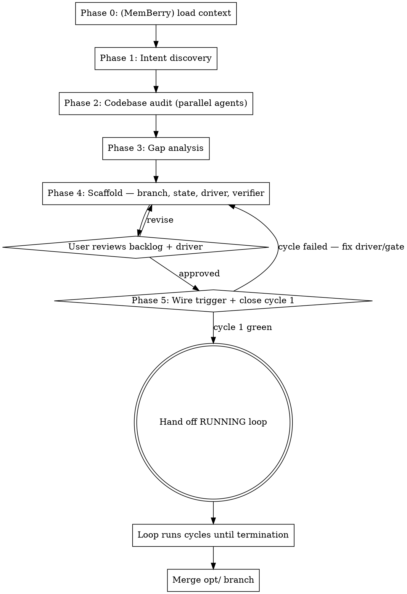

# Optimization Loop

Produce a **running, self-sustaining optimization loop** for any codebase: repeated cycles of improvement — fixing known issues, discovering new ones, re-measuring a metric vector, and tracking progress across session restarts.

This is a **specialized loop built on [loop-engineer](../loop-engineer/SKILL.md)**: same state spine, same driver convention, same maker≠checker discipline. What this skill adds is everything optimization-specific — intent discovery, the parallel audit that derives codebase-specific dimensions and a measurable baseline, the no-regression ratchet, dual-mode (backlog + discovery) cycles, and metric-driven termination.

**Output:** a live loop in the target repo — `agent-state/loop-state.md` carrying the backlog + metric floors, a dual-mode driver at `docs/prompts/<name>-optimizer-driver.md`, a separate verifier gating every session, a wired trigger, and **cycle 1 closed green**. Plus an intent summary when planning docs are contradictory.

**Two core principles:**
1. **Audit first, then optimize.** Never write a generic optimization plan from assumptions — discover what THIS codebase needs through structured investigation.
2. **Hand off running.** Per loop-engineer's Phase 7 discipline: never hand off a loop that has not closed one full cycle. Artifact generation is the middle of this skill, not the end.

## How the six-part spine specializes for optimization

| Spine stage | Optimization form |
|---|---|
| **Trigger** | `/loop` interval, scheduled task, or cron — wired in Phase 5, not left to the user |
| **Discovery** | One-time: the Phase 2 audit (builds the backlog). Recurring: each cycle's **Mode B** sweep |
| **Planning** | The top item in the loop-state backlog — kept priority-ordered: each cycle's Mode B inserts a discovered higher-value item ahead of lower-priority ones, so it runs next |
| **Execution** | The maker fixes ONE backlog item (Mode A) + inline discovery fixes (Mode B) |
| **Verification** | A **separate verifier** re-runs the suite and metric commands, enforces the ratchet, inspects the diff — and can REJECT |
| **State update** | Session entry + metric deltas appended to `loop-state.md`; code and state commit together |

## Two layers — read this before you start

1. **Layer 1 (the process YOU run now)** — audit, gap analysis, scaffolding, wiring the trigger, closing cycle 1. You perform these steps.
2. **Layer 2 (text that goes INTO the loop)** — the driver, the loop-state blocks, the verifier instructions. You *author* this; a **loop-agent** runs it later, cycle after cycle. Template bodies written in the imperative are addressed to that future agent, not to you.

## Persistence — required vs. optional

`agent-state/loop-state.md` is the **REQUIRED** restart mechanism; the loop works with nothing else. **MemBerry** (a Neo4j knowledge-graph MCP server) is an **OPTIONAL adapter** for cross-session *learning* — skip every step labelled **(MemBerry)** when its tools are absent. The state file tracks *what's done*; MemBerry remembers *what was learned*. When present, its tiers map naturally:

| MemBerry tier | Optimization use |
|----------|-----------------|
| **Core: `current_objective`** | Current backlog focus + overall optimization goal |
| **Core: `project_state`** | Health scores, completion %, metric vector |
| **Working: `working_state`** | This cycle's Mode A item + Mode B discoveries (crash recovery) |
| **Working: `open_questions`** | Ambiguities found during the cycle |
| **Archive (`berry_store`)** | Each cycle's decisions, root causes, conventions — the *why* |

## Git versioning

Every optimization loop runs on its own branch: `opt/<project>-<focus>` (pick `<focus>` from what the audit found — `hardening`, `wiring-fixes`, `test-coverage`). One commit per cycle, bundling Mode A + Mode B work + the state update — the cycle is the atomic unit. Merge when the loop terminates. If the branch tracks an active integration branch, sync each cycle rather than letting it drift for a multi-week pass; a solo/local pass can skip syncing.

## When to Use

- A feature sprint just ended and the codebase needs hardening/polish.
- Shifting from "build" mode to "improve" mode.
- You want an agent continuously finding and fixing bugs, dead code, performance issues, and wiring gaps — unattended, with guardrails.
- Planning documents exist but may be incomplete, contradictory, or stale.
- Previous optimization work happened but nobody tracked what's finished.

## When NOT to Use

- Brand-new codebase (nothing to optimize — do design/planning first).
- One specific bug — just fix it with your host's debugger/**bugfix** (external, not shipped in this jar), or run **bug-pipeline** for an ongoing defect pipeline.
- A loop whose job isn't optimization (triage, releases, migrations) — use **loop-engineer** directly.
- Hypothesis-driven experimentation against a frozen eval harness, chasing one scalar (training speedruns, prompt optimization) — use **auto-research**.
- Judgment-driven architecture work — deepening shallow modules, fixing seams, reducing AI-driven drift — where a human owns direction, not an automated metric ratchet — use **improve-architecture**.

## Known pressure rationalizations — do not fold

These surface when feature work just merged, the gate is already green, and a near-deadline ("20 minutes before I leave", "running by the time I walk out") tempts you to ship a prompt instead of a closed loop. Each is a hard STOP, not a judgment call. A green binary gate and a deadline change **nothing** about what the deliverable is.

| Rationalization | Required response |
|---|---|
| "The audit prints '208 checks, 0 failed' — that IS my metric and my baseline; the no-regression rule is just 'keep audit-jar.py exiting 0.'" | The binary gate (Verification Commands, exits 0/1) is NOT the metric vector. "0 failed" is one boolean; a baseline is a vector of *re-runnable numbers* — check count, per-dimension scores, lint/type/coverage/size counts — that can degrade while the gate stays green. Derive the vector in Phase 2 from real commands, or the loop runs open-loop. |
| "'Harden the jar' is intent enough; a real audit + intent pass would eat my whole 20 minutes and I'd ship nothing." | The deadline does not delete Phases 1–2. Without the audit there is no file-level backlog and no baseline, so cycle 1 has nothing concrete to do — you'd ship churn, not hardening. Run the parallel audit (it IS the 20 minutes' work); a small real backlog tonight beats a themed prompt. |
| "Write the backlog as themes the smart loop can self-direct on ('tighten descriptions', 'reduce doc drift') — enumerating file-level items by hand is the manual work the loop replaces." | Refuse the themed backlog. Every Open Task names exact files, a concrete fix, and a falsifiable Acceptance command (the Phase-4 checklist gate). "The agent will pick files" is the generic-prompt mistake — a themed loop optimizes nothing measurable. The audit does the enumeration; that is the deliverable, not the loop's job. |
| "The deliverable is a good driver prompt; wiring the trigger and running a cycle is the loop's job, not mine — I just set it up." | "Hand off running" is a core principle, not optional polish. Phase 5 is YOURS: wire the trigger AND close cycle 1 end-to-end yourself. A prompt on a shelf with unrun acceptance commands is not a loop. |
| "The audit's at 0 failed, so there's nothing for cycle 1 to fix tonight; the overnight run is its own first cycle." | A green gate does not mean an empty backlog — the audit surfaces dead wires, low scores, and drift that exit 0. Close cycle 1 on backlog item #1 yourself, now. If cycle 1 truly can't close (no item, acceptance won't run, metric recipe is broken), that is a Phase-5 defect to fix BEFORE handoff — not a thing to let the overnight run discover. |
| "A no-regression ratchet on top of an already-green gate is redundant — if audit stays at 0 failed and tests pass, nothing regressed." | False. The gate cannot see a description quietly weakened, coverage dropping, or a count creeping up — all exit 0. The metric ratchet is a SEPARATE down-only/up-only floor on top of the gate, re-measured every cycle. Keep both. |
| "Log 'audit: 0 failed, all good' in loop-state.md and call setup complete; if the loop hits something weird the human reads failed-attempts.md in the morning." | "0 failed, all good" is not a baseline and skips closing cycle 1 — two STOPs in one. The Metric Vector table must carry real numbers from commands that ran (Phase-4 checklist), and cycle 1 must close green before handoff. Don't outsource your setup verification to the overnight run and the morning's reader. |

## The Process (Layer 1)



---

## Phase 0 (optional): Load MemBerry context

**If MemBerry is available:** check the project's CLAUDE.md for its config, then `berry_load(task: "optimization loop: audit and improve codebase", tags: ["project:<tag>"], max_tokens: 4000)`. Prior sessions may have already audited dimensions or established conventions — don't rediscover what's known. If MemBerry is present but unconfigured, invoke `memberry-setup`. If absent, skip this phase entirely.

---

## Phase 1: Intent Discovery

Before reading code, find out what the codebase is *supposed to be*.

**Where to look:** MemBerry results first (if available); `docs/plans/`, `docs/specs/`, `docs/prompts/`; `CLAUDE.md`, `AGENTS.md`, `README.md`, `ARCHITECTURE.md`; any `*.plan.md` / `*.spec.md` / `*.design.md`; auto-memory directories; `git log --oneline -30` for stated goals in commit messages.

**What to extract:** stated goal / end state; feature lists with completion markers; TODO/FUTURE/PHASE-N items; architectural decisions and constraints; contradictions between documents.

**Synthesize one answer:** *"What is this codebase trying to become?"* This is the north star — without it the loop can't distinguish dead code that should be deleted from an unfinished feature that should be completed.

**If documents are fragmented or contradictory:** flag the contradictions for the user and generate the Intent Summary artifact (Phase 4).

---

## Phase 2: Codebase Audit

Dispatch parallel exploration agents. **Do not use predefined dimensions** — discover what matters for THIS codebase.

### Agent dispatch template

Launch 4–6 agents in parallel; adapt focus areas to the codebase type:

**Agent 1 — Architecture & Structure**
> "Read the entry points, module boundaries, and dependency graph. How do modules communicate? Circular dependencies? Where are the seams? Compare against the intended architecture: [intent summary]. Report: what's well-structured, what's tangled, what's missing."

**Agent 2 — Test Health**
> "Run the test suite. Report: total tests, pass rate, failures (with errors), flaky tests (run twice if needed), slowest tests. Check coverage if tooling exists. Flag zero-coverage modules as 'fix-requires-test-first' so backlog items touching them carry that constraint."

**Agent 3 — Wiring & Integration**
> "Pick 3–5 key data paths (input → processing → output, config → consumption, event → handler). Trace each end-to-end. Where does data flow correctly? Where are disconnections — output nobody consumes, config parsed but never used, events with no subscribers?"

**Agent 4 — Code Quality**
> "Scan for: dead code, inconsistent error handling, type-safety gaps, hardcoded values that should be config, missing input validation at boundaries, unhandled rejections. Report with file paths and line numbers."
>
> **(FUGAZI)** If [FUGAZI](https://github.com/AP3X-Dev/FUGAZI) (`fugazi` / `fugazi-mcp`) is available, ground this agent in deterministic findings instead of eyeballing: `fugazi dead-code --format json`, `fugazi health --format json` (complexity), `fugazi dupes --format json`, `fugazi boundaries --format json`. Treat dead-code findings as *candidates to confirm* — reflection, DI, and dynamic import defeat static reachability, and a library's public API reads as "unused" internally, so it never gets auto-deleted (that's Phase 3's confirm-before-destroying rule). Read-only only; never run `fugazi fix` in an audit.

**Agent 5 — Build & Config** (if applicable)
> "Check build pipeline health, dependency versions, configuration completeness, environment handling, CI/CD. Report gaps."

**Adapt to the codebase.** A frontend app needs a UI/accessibility/bundle agent; a CLI needs shell-compat; an API needs endpoint coverage. Choose agents matching what the codebase IS.

### Score each dimension

From the reports, identify 5–8 natural dimensions for this codebase. For each: **name it**, **score it** (% solid vs. needs work), **list concrete findings** (files, problems), and **record a re-runnable measurement recipe** — the exact command and current number THIS toolchain produces (test pass count, `tsc --noEmit` error count, coverage %, lint warnings, bundle bytes, a key benchmark). **(FUGAZI)** Its finding counts make excellent ratchet metrics — the `fugazi dead-code` / `health` / `dupes` totals, the `complexity-hotspot` count, or the maintainability score, each a deterministic number that should trend down-only across cycles. If a dimension has no cheap measurement, write "n/a — no tooling" and keep it qualitative. **Never invent tooling.** This baseline vector is the loop's *setpoint*: re-measured every cycle and ratcheted so the loop can tell improvement from churn.

### (MemBerry) Store audit findings

If present: `berry_store` the baseline (dimensions + scores + metric vector + top priorities) and update the `project_state` core block. Skip entirely if absent.

---

## Phase 3: Gap Analysis

Compare intent (Phase 1) against reality (Phase 2). Classify every finding:

| Classification | Meaning | Priority |
|---|---|---|
| **In plan, not implemented** | Unfinished planned work | High |
| **In plan + implemented, not wired** | Feature exists but never reaches its consumer | High — dead wire |
| **Implemented, not in any plan** | Organic addition — useful or cruft | Medium — verify with user |
| **In multiple plans, conflicting** | Documents disagree | **Block** — needs user decision |
| **Implemented, contradicts plan** | Code drifted from intent | Medium — fix or update plan |
| **Verified complete** | Working, tested, wired | Done — "already done" list |

**Estimate cycle count** per non-done item — "~20 cycles" is useful, "many" is not.

**Treat destructive findings as claims, not facts.** Auditor assertions of "dead code", "unused config", "no subscriber" are frequently wrong — code loads via reflection, dynamic import, string-keyed registries. Mark every remove/delete/disconnect finding *candidate to confirm*; the driver's confirm-before-destroying rule requires reproduction evidence before acting.

---

## Phase 4: Scaffold the loop

### 4a. Branch + skeleton

```
git checkout -b opt/<project>-<focus>
# scaffold-loop.py ships with loop-engineer (../loop-engineer/scripts/ in your skill-jar checkout)
python ../loop-engineer/scripts/scaffold-loop.py --loop-name <project>-optimizer --repo . --host <claude|codex|both|generic> --level 2
```

The scaffolder lays down `agent-state/`, `AGENTS.md` (keep it — its safety floor applies verbatim), and the driver stub. Everything below *fills* that skeleton.

### 4b. Fill `agent-state/loop-state.md`

Standard loop-engineer blocks, plus three optimization-specific ones:

```md
## Current Objective
<the synthesized intent, one paragraph — what this codebase is trying to become,
and this pass's focus>

## Verification Commands
- Tests:  <exact command>          <!-- the gate; exits 0/1 -->
- Lint / Typecheck / Build:  <exact commands, delete absent ones>

## Metric Vector & Ratchet Floors
| Metric | Command | Baseline | Floor (running best) | Direction |
|--------|---------|----------|----------------------|-----------|
| <test pass count> | <cmd> | <n> | <n> | up-only |
| <tsc errors> | <cmd> | <n> | <n> | down-only |
<one row per Phase-2 measurement recipe. Floors advance on improvement and
may never regress without a logged one-line waiver in the session entry.
This vector is REQUIRED and is NOT the Verification gate above: a green gate
("0 failed") is one boolean and cannot see a count creeping up, coverage
dropping, or a description weakened — all exit 0. Each Baseline is a real
number from a command that ran in Phase 2, never the gate's pass/fail. A
single "audit: 0 failed" line here is not a baseline — that is the empty loop.>

## Open Tasks  (the backlog — a maintained priority queue, descending)
| ID | Task | Owner | Priority | Status | Files | Acceptance (exits 0) |
<every Phase-3 item: exact files, concrete fix, falsifiable acceptance.
Within a tier, planned-missing and dead-wire items outrank cleanup.
Destructive items carry their Evidence requirement in the Task cell.
This is a priority queue, not an append log: Mode B inserts each discovery at
its priority rank, so a found High/Medium jumps ahead of pending Lows. The top
row is therefore always the highest-value pending work — what the next cycle
runs. IDs are stable identifiers, NOT execution order; never reorder by ID.>

## Already Done — Do Not Re-Audit
<verified-complete areas with evidence. An area stays here only until code in
it changes — then it returns to the backlog for re-verification.>

## Blocked — Needs User Decision
| ID | Item | Conflict / question | Raised (cycle) | Status |

## Session History
<!-- one entry per cycle; format in the driver's step 8 -->
```

### 4c. Author the driver — `docs/prompts/<project>-optimizer-driver.md`

The per-cycle prompt (Layer 2 — imperative, addressed to the loop-agent). It walks the spine in dual-mode form:

```md
# <Project> Optimizer — Driver (one cycle)

You run ONE optimization cycle on branch opt/<project>-<focus>, then stop.

## 0. Preflight
Check out the opt branch. `git status` — if dirty from a crashed cycle, recover
the in-flight item ((MemBerry) read `working_state`; else the last Session
History entry) and either finish it from the partial diff or revert to the last
green commit; log the recovery. Sync with <remote>/<branch> if the branch
tracks active integration; STOP and ask the human past <threshold> divergence.

## 1. Load
Read agent-state/loop-state.md: objective, verification commands, metric
floors, and the TOP (highest-priority) Open Task — the backlog is priority-
ordered, so take the top row, never the lowest unfinished ID. (MemBerry)
`berry_load` for conventions and gotchas;
set `working_state` to the in-flight item. Check failed attempts and Blocked —
never retry a logged dead end or a blocked item.

## 2. Mode A — execute ONE backlog item
Read every file it names → implement the smallest fix that satisfies its
Acceptance command. For any remove/delete/rewire item: reproduce the claim
first (re-grep INCLUDING dynamic/string/reflection references — registries, DI,
dynamic import, config-keyed lookups); if no-consumer can't be reproduced, mark
"unconfirmed — needs investigation" and skip. Prefer a failing test before the
fix, especially in modules flagged fix-requires-test-first.

## 3. Mode B — discovery sweep
While context is hot: run the suite, linters, type checkers — investigate
warnings, not just errors. Read code adjacent to the fix. Reflect in ONE
sentence: what assumption did the fix rely on, and what nearby code shares it?
(That names the next files to check; if it yields no concrete lead, skip.)
Trace one integration path end-to-end.
- Small find (<15 min, adjacent) → fix now, log as Discovery fix.
- Larger → new backlog row with files, priority, source ("found fixing #7") —
  ONLY if impact ≥ Medium or it moves a tracked metric. Below the bar:
  fix-now-or-skip. A clean sweep is a valid, successful cycle.
- **Insert by priority, never append.** Place the new row at its priority rank,
  so a discovered High/Medium lands ABOVE pending Lows and becomes the top of
  the backlog — the next cycle runs it before the lows it leapfrogged. Example:
  backlog is 10 Lows, this sweep finds one Medium → the Medium goes to the top,
  the 10 Lows shift down, next cycle takes the Medium. Never push a higher-value
  find to the bottom behind cheaper work. (Re-sorting only moves discoveries
  relative to existing items; it never reorders or re-prioritizes a row a human
  set — leave human-assigned priorities intact.)

## 4. Verification — a SEPARATE verifier agent gates the cycle
Hand the diff to the verifier. It independently: re-runs the Verification
Commands (suite must execute and report a real test count — zero tests is a
STOP, never a pass); re-runs every Metric command and compares against the
floors; inspects the diff for scope creep, weakened/skipped/deleted tests, and
unconfirmed destructive changes. Verdict PASS or REJECT with evidence.
On REJECT: revert, log the attempt + lesson to Failed Attempts, end the cycle.

## 5. Ratchet
On PASS: advance any improved floors. A regressed metric is a REJECT unless
the session entry carries a one-line waiver explaining why (e.g. "deleted 3
tests for a removed dead module — intentional").

## 6. State update + commit (code and state together)
Move the item to Completed (commit SHA), insert each new discovery at its
priority rank in Open Tasks (a Medium/High jumps ahead of pending Lows — never
appended to the bottom), update the status counts and metric table, write the
Session History entry:

  ### Cycle N — <date>
  - Commit: `<sha>` opt(N): <title>
  - Backlog item: #X — COMPLETED / IN PROGRESS / SKIPPED (reason)
  - Mode B: <discoveries> found, <n> fixed inline, <n> added as #Y, #Z
    (note any inserted ABOVE existing items, e.g. "#Y Medium inserted ahead of Lows")
  - Verifier: PASS/REJECT (<evidence summary>)
  - Metrics (vs floor / vs baseline): <metric>: <prev>→<curr>, ...  <waiver?>
  - Next cycle starts at: top of backlog (= <ID/title>) / continue #X / Mode B
    only — name the row the priority order now puts first, which may be a
    discovery just inserted ahead of lower-priority items, not mechanically #X+1

Then ONE commit: `git add <changed files> agent-state/` →
`opt(N): <item title> + M discovery fixes`. Never commit a red gate.

## 7. (MemBerry) Store
Root causes, conventions, signals — the why, never a paste of the log entry.
Archive `working_state`. Skip if MemBerry is absent.

## Rules
- One backlog item in flight per cycle; split oversized items, complete one
  sub-item, mark the parent IN PROGRESS. Unlimited Mode B discovery fixes.
- Smallest diff that works. No drive-by renames/reformatting. Treat
  suppressions and unusual-but-working code as deliberate — log to Blocked,
  don't "fix" silently.
- Never weaken, skip, or delete a test to pass; a wrong test is a logged
  backlog item. If a correct fix breaks a test, the test is suspect — verify
  which encodes the right behaviour before touching either.
- Evidence: every discovered item cites file:line + an observable symptom.
  Unconfirmed suspicions go to Blocked/open_questions, not the backlog.
- Stop and ask the human (write to Blocked, skip, continue other work) when an
  item: conflicts with the intent summary; changes a public API/schema/config/
  on-disk format; deletes code referenced outside its module; passes tests only
  by changing expectations; is clearly multi-cycle; or rests on ambiguous
  intent. Expensive-to-reverse guess → ask; cheap-and-obvious → do and log.
```

The generating agent specializes every `<placeholder>` and the stop-and-ask list with the specific APIs, formats, and cross-module exports the audit found.

### 4d. Wire maker≠checker

Two agents from loop-engineer's [subagent-templates](../loop-engineer/references/subagent-templates.md), specialized:
- **Maker** (implementer): executes driver steps 2–3. Never marks its own work verified.
- **Verifier**: executes driver step 4 — re-runs gate + metrics itself, enforces the ratchet and test-integrity, can REJECT. Run it on a different model than the maker where the host allows.

### 4e. Intent Summary (only if planning docs were fragmented/contradictory)

`docs/prompts/<name>-intent-summary.md`: synthesized goal, source-document table, contradictions table (with resolutions or Blocked entries), completion matrix.

### Before proceeding — verify your own output

- [ ] Every backlog item names exact files, a concrete fix, and a falsifiable Acceptance command — no "improve X", no themes the loop is left to "self-direct" on ("tighten descriptions", "reduce drift").
- [ ] Dimensions AND measurement recipes were derived from the audit, not a generic checklist.
- [ ] "Already Done" is non-empty (proves the audit ran).
- [ ] The `opt/` branch exists and is named in the loop-state and driver.
- [ ] The Metric Vector table carries real baseline numbers from commands that actually ran — not the gate's "0 failed" boolean restated as a baseline.
- [ ] Maker and verifier are separate agents; the verifier can reject.
- [ ] Intent Summary exists iff planning docs conflicted.

Present the backlog + driver to the user for review, then:

---

## Phase 5: Wire the trigger + close cycle 1

**This phase is why the deliverable is a loop and not a prompt.**

1. **Wire the trigger** to the host (forms in loop-engineer's [automation-templates §4](../loop-engineer/references/automation-templates.md)): `/loop <interval> docs/prompts/<name>-optimizer-driver.md` in Claude Code; a scheduled `codex exec` for Codex; cron/CI for generic. Pick the cadence with the user — unattended runs spend money, and the human owns the budget.
2. **Run cycle 1 end-to-end, now:** preflight → Mode A on backlog item #1 → Mode B sweep → verifier gates it → ratchet → state + commit. For real, not as a description. A green binary gate ("0 failed") does NOT mean an empty backlog — the audit surfaces dead wires, low-scoring dimensions, and drift that all exit 0; cycle 1 fixes item #1. The overnight run is **not** "its own first cycle": you close cycle 1 here so the driver, acceptance commands, metric recipes, and verifier are proven against the real repo before anyone walks away.
3. **If cycle 1 cannot close green** — the acceptance command was wrong, the metric recipe doesn't run, the verifier's instructions don't fit the repo, or the backlog has no concrete item to act on — that is a Phase-5 defect to fix BEFORE handoff. Fix the driver/state/backlog and re-run. Do not hand off a loop that has never closed once, and never let the overnight run be the thing that discovers your setup is broken.
4. **Hand off:** report the trigger wiring, cycle-1 results (item completed, metrics vs baseline), and the termination conditions the user should expect the loop to report against.

---

## Termination — when the loop is done

The loop-agent evaluates these over the loop-state's own records (per-cycle new High+ items, open High/Block count, the metric vector):

- **CONVERGED** → stop, final suite run, merge. Last ~3 cycles: no new High+ items, open High/Block empty, metrics flat within per-metric epsilon set in the driver.
- **STALLED** → escalate to the human. Metrics and discoveries flat but High/Block items remain — the loop can't progress alone.
- **DIVERGING** → halt immediately, even with green tests. A tracked metric regressed across 2+ cycles without waivers; root-cause before anything else.

**On CONVERGED (or the user calls it):** final suite + metric re-measure on the `opt/` branch; review `git diff main...opt/<branch> --stat`; roll the Blocked table into the merge summary so nothing decided-by-default slips through; **(MemBerry)** store the final summary; merge or open a PR through the repo's normal branch-completion workflow.

---

## Common Mistakes

- **Handing off a prompt instead of a running loop.** Generation without Phase 5 leaves an unproven driver on a shelf — the acceptance commands may not even run. Close cycle 1 first. A near-deadline ("20 minutes, then I leave") does not move this gate or make Phase 5 "the loop's job" — wiring the trigger and closing cycle 1 are yours; ship a closed cycle or ship nothing.
- **Writing generic prompts without auditing.** "Improve performance and quality" is useless. "Item 3: wire searchEndpoint config from Config.swarm through bin.ts to the runner constructor" is actionable.
- **Skipping intent discovery.** Without it, every dead wire might be a TODO, not a bug.
- **A fixed backlog with no Mode B.** Codebases have issues that only surface when you fix adjacent code.
- **Appending discoveries to the bottom of the backlog.** The backlog is a priority queue, not an append log. A Mode B discovery rated Medium/High must be inserted ahead of pending Lows so the next cycle runs it first; appended at the bottom, a critical find sits behind 10 trivial items for 10 cycles.
- **The maker grading its own cycle.** Without a separate verifier, plausible-but-wrong fixes and quietly weakened tests survive. This loop's verifier re-runs everything itself.
- **Measuring once, then flying blind.** Score at audit time but never re-measure and the loop goes open-loop: quality erodes while tests stay green. Ratchet every cycle.
- **Acting on auditor claims without confirming.** "Dead code" and "no subscriber" findings are routinely wrong. Reproduce destructive claims or skip the item.
- **Duplicating the state file into MemBerry.** The state file tracks what's done; MemBerry stores root causes, conventions, tradeoffs. Never paste the session entry into `berry_store`.
- **Predefined dimensions or invented metrics.** Let the audit discover what THIS codebase can actually measure.
