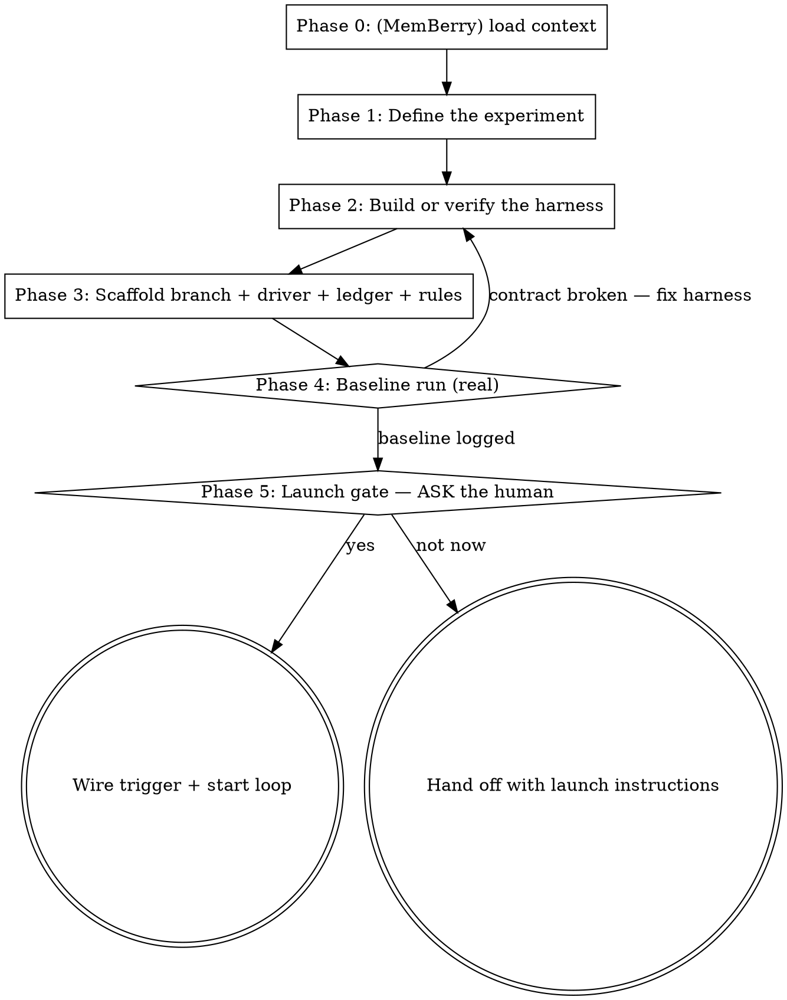

# auto-research Skill Implementation Plan

> **For agentic workers:** Implement this plan task-by-task with host-native subagents or inline execution plus review checkpoints. If Superpowers `subagent-driven-development` or `executing-plans` is installed, it is a useful accelerator, not a prerequisite. Steps use checkbox (`- [ ]`) syntax for tracking.

**Goal:** Add the `auto-research` skill (Karpathy-style fixed-budget experiment loops) to the skill jar, with cross-routing edits and regenerated indices, gate-green and committed locally.

**Architecture:** A standalone skill at `development/auto-research/` — the jar's third specialized loop on loop-engineer conventions — consisting of a SKILL.md (Layer 1 process) and two references (Layer 2 driver/scaffold templates, harness design guide). Spec: `docs/superpowers/specs/2026-06-09-auto-research-skill-design.md`.

**Tech Stack:** Markdown skills with YAML frontmatter; repo gate `python scripts/audit-jar.py`; generated indices via `scripts/gen-index.py` and `scripts/gen-plugins.py`.

**Repo rules that bind this work:** commit locally, never push; natural commit messages with no attribution trailers; the gate must exit 0 before the work is called done.

---

## File structure

```
development/auto-research/
  SKILL.md                          # CREATE — Layer 1 process, routing, adapted conventions, mistakes
  references/driver-template.md     # CREATE — Layer 2 driver + experiment-state + ledger + AGENTS.md templates
  references/harness-design.md      # CREATE — metric/budget/surface/freeze design guide, domain table, worked example
development/loop-engineer/SKILL.md  # MODIFY — third bullet under "Specialized loops this skill can scaffold"
development/optimization-loop/SKILL.md  # MODIFY — description NOT-for + When-NOT-to-Use bullet
README.md                           # MODIFY — table row + skill count line
skills.json                         # REGENERATE via scripts/gen-index.py
development/.claude-plugin/plugin.json  # REGENERATE via scripts/gen-plugins.py
```

The audit gate constrains the new SKILL.md: frontmatter must parse with `name: auto-research` (matches directory), description non-empty, ≤ 1024 chars, containing a "Use when" trigger phrase; every relative link must resolve (link targets containing `<` are skipped as placeholders).

---

### Task 1: Create `development/auto-research/SKILL.md`

**Files:**
- Create: `development/auto-research/SKILL.md`

- [ ] **Step 1: Write the file with exactly this content**

````markdown
---
name: auto-research
description: "Use when the user wants a Karpathy-style auto-research loop — an agent autonomously running fixed-budget experiments against a frozen evaluation harness to optimize ONE scalar metric: hypothesize → mutate the experiment surface → run → keep or discard by the metric → log → repeat until interrupted. Generalizes the autoresearch/nanochat pattern to any domain with a runnable metric (model training, prompt optimization, algorithm performance, compression, benchmark scores). Builds the harness if the repo lacks one, scaffolds the loop on loop-engineer conventions, runs the real baseline, then OFFERS launch — never auto-launches. Triggers: 'karpathy loop', 'autoresearch', 'overnight experiments', 'let it experiment while I sleep', 'optimize this metric autonomously'. NOT for correctness/quality hardening (use optimization-loop), defect repair (use bug-pipeline), or non-experiment loops (use loop-engineer)."
---

# Auto-Research

Build a **Karpathy-style auto-research loop**: an agent runs fixed-budget
experiments against a frozen evaluation harness, chasing ONE scalar metric —
hypothesize → mutate the experiment surface → run → keep or discard by the
metric → log → repeat until the human interrupts. The pattern comes from
Karpathy's [autoresearch](https://github.com/karpathy/autoresearch) repo (a
nanochat-derived training speedrun: the agent edits `train.py` overnight
chasing lower `val_bpb`); this skill generalizes it to any domain where one
command can produce the number: model training, prompt optimization,
algorithm performance, compression, benchmark scores.

This is the jar's third **specialized loop built on
[loop-engineer](../loop-engineer/SKILL.md)** conventions, alongside
[optimization-loop](../optimization-loop/SKILL.md) and
[bug-pipeline](../bug-pipeline/SKILL.md).

**Output:** a loop scaffolded into the target repo — a `research/<tag>`
branch, a specialized driver at `docs/prompts/<tag>-research-driver.md`, an
untracked `results.tsv` ledger + `experiment-state.md`, research rules in
`AGENTS.md`, a **real baseline run already logged** — and then a launch
**offer**. Never an auto-launched loop.

**Two core principles:**

1. **One number, one surface, everything else frozen.** The loop optimizes
   exactly one scalar, edits (ideally) one file, and treats the harness as
   read-only ground truth. Every loosening of those three multiplies the ways
   the loop can fool itself.
2. **The human owns the launch.** Experiments spend real compute. Build
   everything, prove the harness with a baseline, present the cost per cycle —
   then ask.

## How the six-part spine specializes for research

| Spine stage | Auto-research form |
|---|---|
| **Trigger** | Offered at the launch gate (run-now in session, `/loop`, or local cron) — never wired silently |
| **Discovery** | The ledger: the last ~20 rows of `results.tsv` — what worked, crashed, plateaued |
| **Planning** | ONE hypothesis per cycle, informed by the ledger |
| **Execution** | Mutate the experiment surface, commit, run the harness at the fixed budget |
| **Verification** | The frozen harness IS the checker (see below), plus the frozen-paths integrity gate |
| **State update** | One TSV row per experiment; the branch advances (keep) or resets (discard) |

## Two layers

Same convention as the sibling skills. **Layer 1** is what YOU do now: define
the experiment, build/verify the harness, scaffold, run the baseline, offer
launch. **Layer 2** is text you author for the future loop-agent — everything
inside the template fences in
[references/driver-template.md](references/driver-template.md). Imperative
sentences there address that agent, not you.

## Where the state lives — and why it's untracked

This loop deliberately does NOT use the full `agent-state/` spine. The pattern
carries its own state, minimally:

- **`results.tsv`** is the ledger — completed work and failed attempts in one
  append-only table.
- **The git branch** is the keep/discard memory — advance on improvement,
  `git reset --hard` on regression.
- **`experiment-state.md`** (~15 lines) is the cold-restart anchor: objective,
  run command, budget, frozen paths + freeze commit, baseline, current best.

`results.tsv`, `experiment-state.md`, and `run.log` stay **untracked and
gitignored**. That is what makes discard-by-reset safe: the ledger survives
every reset, and experiment commits contain only the surface change.

**Honest limitation:** because the ledger lives only in the working tree, this
loop runs **in-session or on the local machine** (cron + headless CLI). Cloud
Routines clone fresh from the default branch and would see neither ledger nor
state. This deviates from loop-engineer's commit-state-with-code rule
deliberately; do not "fix" it by committing the ledger — that breaks reset
semantics.

## Maker≠checker, adapted

The jar's rule exists so no agent grades its own work. In this loop the grader
is the **frozen harness**: an objective, deterministic command whose verdict
the agent cannot argue with — plus an integrity gate proving the harness
wasn't touched (`git diff` over the frozen paths against the freeze commit
must be empty, every cycle). A second verifier agent would add cost without
rigor when the verdict is a number printed by frozen code. This adaptation is
designed, not forgotten.

## When to Use

- The user wants an agent experimenting unattended (overnight) to push one
  measurable number: training loss, eval accuracy, ops/sec, bytes, latency.
- The user mentions Karpathy's autoresearch, "speedrun", or wants the
  hypothesize→run→keep/discard pattern on their own problem.
- A repo has (or can get) a command that produces a scalar metric under a
  fixed budget.

## When NOT to Use

- Multi-metric quality/correctness hardening on an existing codebase — use
  **optimization-loop** (backlog + ratchet, not keep/discard).
- Finding and fixing defects — use **bug-pipeline**.
- No runnable metric exists and none can be built (taste, design, UX) — there
  is nothing for the loop to optimize.
- A one-off benchmark or A/B comparison — just run it.

## The Process (Layer 1)



### Phase 0 (optional): Load MemBerry context

If MemBerry tools are available, `berry_load` prior context for the target
project (past experiments, known constraints). Skip entirely when absent —
the loop is fully functional without it.

### Phase 1 — Define the experiment

Pin down four things with the user and the repo. Write them down; they become
`experiment-state.md` fields in Phase 3.

1. **Objective** — exactly ONE scalar with a direction (`val_bpb` ↓,
   `tokens/sec` ↑, `accuracy` ↑). If the user wants two metrics optimized,
   that's a different job (optimization-loop) or two separate runs. Soft
   constraints (memory, cost) are allowed — recorded, not optimized.
2. **Mutable surface** — the file(s) the loop may edit. Fight for ONE file;
   it keeps every diff reviewable and every reset clean.
3. **Frozen harness** — eval code, data prep, metric reporting, listed by
   explicit path. Read-only ground truth.
4. **Budget** — fixed wall-clock / iterations / API calls / dollars per run,
   so every experiment is comparable. Fixed budget also means the loop finds
   the best configuration *for this platform at this budget*.

Full guidance, the domain table, and the worked example:
[references/harness-design.md](references/harness-design.md).

### Phase 2 — Build or verify the harness

The harness contract, regardless of domain:

1. One run command, runnable from the repo root.
2. The budget is enforced INSIDE the harness (timer, iteration cap, call
   cap) — not by the agent's promise to stop.
3. Metrics print greppably, one per line: `<metric_name>: <value>`.
4. Crashes exit nonzero / produce no metric line.

If the repo lacks a harness, build it now with the user — this is real
engineering work and the skill's biggest value-add. If one exists, verify the
contract instead (run it once; check the grep works). Design guidance:
[references/harness-design.md](references/harness-design.md).

### Phase 3 — Scaffold

1. Branch: `git checkout -b research/<tag>` (tag from date, e.g. `jun9`; must
   not already exist — a fresh run gets a fresh branch).
2. Driver: specialize every `<placeholder>` in
   [references/driver-template.md](references/driver-template.md) →
   `docs/prompts/<tag>-research-driver.md`.
3. Ledger: create `results.tsv` with only its header row.
4. State: create `experiment-state.md` from the template (baseline fields
   blank until Phase 4).
5. Rules: append the research-rules block to the target repo's `AGENTS.md`.
6. Gitignore: add `results.tsv`, `experiment-state.md`, `run.log`.
7. Commit the driver, `AGENTS.md`, and `.gitignore` (NOT the ledger/state).

### Phase 4 — Baseline run

Run the unmodified code for real: `<run command> > run.log 2>&1`. Extract the
metric. Row 1 of `results.tsv` is always `baseline`. Fill `Baseline` and
`Current best` in `experiment-state.md`. If extraction fails or the budget
isn't enforced, the harness contract is broken — go back to Phase 2. Never
offer launch on an unproven harness.

If the metric is noisy (common outside ML training: API-judged evals,
wall-clock benchmarks), run the baseline twice and record the spread as the
noise floor in `experiment-state.md` — the keep rule uses it.

### Phase 5 — The launch gate

**Never start the loop unprompted.** Present:

- Cost per cycle: the budget, plus startup overhead measured in Phase 4.
- Throughput: ~`60 / (budget_min + overhead_min)` experiments/hour.
- Trigger options: **run now in this session** (the agent loops until
  interrupted — Karpathy's mode), **`/loop` with the driver** at an interval
  ≈ cycle time, or **local cron + headless CLI** running one cycle per
  invocation.
- What the human still owns: spend, when to stop, and what to do with the
  winning branch.

Then ASK: launch now? **Yes** → wire the chosen trigger and start. **No** →
hand off with the exact launch command for each option.

## Before the launch offer — verify your own output

- [ ] Objective is ONE scalar with a direction; the metric line greps from a
      real run log, not from documentation.
- [ ] Budget is enforced inside the harness — kill-switch confirmed, not
      promised.
- [ ] Frozen paths are listed in `experiment-state.md` with the freeze commit
      SHA; the integrity-gate command runs and exits 0.
- [ ] Baseline row exists in `results.tsv`; state file fully filled.
- [ ] The driver names real commands and paths — zero unfilled
      `<placeholders>`.
- [ ] `AGENTS.md` rules and `.gitignore` entries committed on the research
      branch.
- [ ] Launch was OFFERED with costs, not performed.

## Common Mistakes

- **Mutable surface too broad.** Multi-file experiments produce unreviewable
  diffs and messy resets. One file, expand only with evidence it's too small.
- **Metric not greppable.** If extraction is fuzzy, the loop logs garbage and
  keep/discard decisions are noise.
- **Comparing runs across different budgets.** Changing the budget mid-run
  invalidates every prior row; numbers stop meaning anything.
- **Letting the agent "fix" the eval.** That's reward hacking — the integrity
  gate exists for exactly this. A frozen path is never edited, period.
- **Committing the ledger.** Breaks reset semantics and pollutes experiment
  commits. Untracked is a feature.
- **Multi-metric objectives.** "Improve accuracy AND latency" is
  optimization-loop's job or two runs; a single keep/discard rule needs a
  single number.
- **Stopping mid-loop to ask permission.** The launch gate was the
  permission. Once launched, the loop runs until the human interrupts — the
  only self-stop is a broken harness (3+ consecutive contract failures).

---

**Guiding principle:** the loop's power comes from what it is NOT allowed to
do. A tiny mutable surface, a frozen judge, a fixed budget, and an append-only
ledger turn "let the agent try things overnight" from a gamble into an
experiment.
````

- [ ] **Step 2: Sanity-check the gate constraints by eye**

Confirm in the written file: frontmatter `name: auto-research` (matches the directory), the description starts with "Use when" (trigger regex needs `use when|whenever|during`), and the only relative link targets are `../loop-engineer/SKILL.md`, `../optimization-loop/SKILL.md`, `../bug-pipeline/SKILL.md`, and `references/driver-template.md` / `references/harness-design.md` (created in Tasks 2–3).

---

### Task 2: Create `development/auto-research/references/driver-template.md`

**Files:**
- Create: `development/auto-research/references/driver-template.md`

- [ ] **Step 1: Write the file with exactly this content**

````markdown
# Auto-research — driver & scaffold templates (Layer 2)

Everything in the fences below is text you SPECIALIZE and INSTALL into the
target repo — written in the imperative for the future loop-agent, not for
you. Replace every `<placeholder>`; the skill's pre-launch checklist fails on
any leftover.

| Placeholder | Meaning | autoresearch example |
|---|---|---|
| `<tag>` | run tag, from the date | `jun9` |
| `<metric_name>` | the one scalar, as printed in the log | `val_bpb` |
| `<direction>` | `lower` or `higher` | `lower` |
| `<run command>` | the harness invocation | `uv run train.py` |
| `<budget>` | fixed budget per run | `5 minutes wall-clock` |
| `<mutable surface>` | path(s) the agent may edit | `train.py` |
| `<frozen paths>` | read-only harness paths | `prepare.py` |
| `<freeze commit>` | SHA recorded at scaffold time | `a1b2c3d` |
| `<constraint_name>` | soft-constraint column | `memory_gb` |
| `<noise floor>` | min improvement that counts | `0.0005` or `0 (not measured)` |

## 1. The driver — install at `docs/prompts/<tag>-research-driver.md`

```md
# <tag> Auto-Research — Driver (one experiment per cycle)

You are an autonomous researcher on branch `research/<tag>`. One goal: make
**<metric_name>** go <direction>, as measured by the frozen harness. You run
experiments until the human interrupts you. You do not ask whether to
continue — the human already decided at the launch gate.

## Orient

1. Read `experiment-state.md`: objective, run command, budget, frozen paths,
   current best, noise floor.
2. Read the LAST ~20 rows of `results.tsv` — never the whole file, never the
   full run logs. The ledger tells you what worked, what crashed, and what
   plateaued.
3. Note your reset point: `git rev-parse --short HEAD` (the current best).

## One experiment

4. **Hypothesize.** ONE idea per cycle, informed by the ledger. Never repeat
   a discarded experiment. Combine prior near-misses. Escalate when
   plateaued: after ~10 experiments without a keep, stop tweaking constants
   and try something structural. If you're out of ideas, think harder —
   re-read the in-scope files, papers referenced in code, and the kept rows
   for an unexploited pattern. Running out of ideas is not a stopping
   condition.
5. **Mutate.** Edit ONLY <mutable surface>. Then commit:
   `git add <mutable surface> && git commit -m "<one-line experiment description>"`
6. **Run.** `<run command> > run.log 2>&1` — redirect everything; never tee
   or stream the log into your context. If the run exceeds 2× <budget>, kill
   it and treat it as a crash.
7. **Extract.** `grep "^<metric_name>:" run.log` and
   `grep "^<constraint_name>:" run.log`. An empty metric grep = crash (see
   Crashes).
8. **Integrity gate.** `git diff --quiet <freeze commit> -- <frozen paths>`
   must exit 0. If it doesn't, you (or the run) touched the frozen harness:
   `git checkout <freeze commit> -- <frozen paths>`, reset to your reset
   point, log a `crash` row "integrity violation", and move on. No
   exceptions; the number from a touched harness is meaningless.
9. **Log.** Append ONE tab-separated row to `results.tsv`:
   `<short sha>\t<metric value>\t<constraint value>\t<status>\t<description>`
   Statuses: `keep` / `discard` / `crash`. On crash: metric `0.000000`,
   constraint `0.0`. Tabs, not commas — commas break in descriptions. Never
   edit or delete existing rows.
10. **Keep or discard.** Your experiment commit sits at the branch tip.
    - Improved by MORE than <noise floor> → keep: leave the commit, update
      `Current best` in `experiment-state.md`.
    - Tie (within the noise floor) → keep ONLY if the change is a
      simplification (less code, same result — that's a win); otherwise
      reset.
    - Worse → discard: `git reset --hard <reset point>`.
    A soft-constraint blow-up (e.g. <constraint_name> far beyond the
    guidance in `experiment-state.md`) turns a metric win into a discard —
    note why in the description.
11. Go to step 1.

## Crashes

Empty metric grep → read `tail -n 50 run.log`. A dumb cause (typo, missing
import, shape error) → fix it on the same commit chain and re-run once or
twice. A fundamentally broken idea → log the `crash` row, reset to your reset
point, move on. If 3+ CONSECUTIVE experiments crash with no metric, the
harness itself may be broken: STOP and report to the human — this is the only
self-stop.

## Rules

- One experiment in flight at a time. The simplicity criterion is policy:
  given equal numbers, less code wins; a tiny gain that adds ugly complexity
  is a discard.
- Frozen paths are READ-ONLY. Never modify what the metric measures, reports,
  or reads. Never install dependencies without human approval.
- `results.tsv` / `experiment-state.md` / `run.log` stay untracked — never
  commit them.
- Rewinding the branch to an earlier kept commit (to escape a dead end) is
  allowed but should be VERY rare. Prefer combining ledger insights forward.
```

## 2. Experiment state — install at `experiment-state.md` (untracked)

```md
# Experiment state — research/<tag>

- Objective: <metric_name> <direction> (extract: `grep "^<metric_name>:" run.log`)
- Run command: <run command>
- Budget per run: <budget> (enforced by: <where in the harness>)
- Soft constraints: <constraint_name> — <guidance, e.g. "some growth OK for real gains; no blow-ups">
- Mutable surface: <mutable surface>
- Frozen paths: <frozen paths>
- Freeze commit: <freeze commit>
- Noise floor: <noise floor>
- Baseline: <value> @ <sha>        <!-- filled by the Phase 4 baseline run -->
- Current best: <value> @ <sha>
- Status: setup | baselined | running | interrupted
- Notes: <one or two lines max — plateau observations, queued radical ideas>
```

## 3. Ledger — install at `results.tsv` (untracked), header row only

```
commit	<metric_name>	<constraint_name>	status	description
```

After the baseline run, row 1 is always:

```
<sha>	<baseline value>	<constraint value>	keep	baseline
```

## 4. Research rules — append to the target repo's `AGENTS.md` (committed)

```md
## Auto-research rules (research/<tag>)

- Frozen paths (<frozen paths>) are READ-ONLY. The metric command is ground
  truth; never modify what it measures, reports, or reads.
- `results.tsv` is append-only — never fabricate, edit, or delete rows.
- Edit only the mutable surface (<mutable surface>). One experiment in
  flight at a time.
- No new dependencies without human approval.
- `results.tsv`, `experiment-state.md`, `run.log` stay untracked
  (gitignored); experiment commits contain only the surface change.
- Never stop to ask permission mid-loop — the launch gate was the
  permission. Self-stop ONLY on 3+ consecutive harness-contract failures
  (broken harness → report to the human).
```
````

---

### Task 3: Create `development/auto-research/references/harness-design.md`, then run the gate expecting only stale-index failures

**Files:**
- Create: `development/auto-research/references/harness-design.md`

- [ ] **Step 1: Write the file with exactly this content**

````markdown
# Designing the experiment harness

The harness is the half of the system the loop can NOT touch. Get it right
and the loop can run unattended all night; get it wrong and every number the
loop logs is noise. This guide covers the four definitions (objective,
budget, surface, frozen paths), the contract, and per-domain shapes.

## The contract

1. **One run command**, runnable from the repo root, e.g. `uv run train.py`,
   `python bench.py`, `npm run eval`.
2. **The budget is enforced INSIDE the harness** — a wall-clock timer, an
   iteration cap, an API-call cap, a token budget. Never rely on the agent
   to stop a run; the harness stops itself.
3. **Greppable metrics**, one per line, stable names:
   `val_bpb: 0.997900` / `accuracy: 0.8125` / `ops_per_sec: 1204231`.
   Print the soft constraint the same way (`memory_gb: 44.0`).
4. **Crashes are loud**: nonzero exit or no metric line. A run that fails
   silently but prints a number poisons the ledger.

## Choosing the objective

- ONE scalar, with a direction. If two numbers matter, either fold them into
  one formula inside the harness (then THAT formula is the objective and is
  frozen) or run two separate research runs.
- Prefer metrics that are budget-fair and config-independent. Karpathy uses
  bits-per-byte instead of per-token loss so vocab changes compare fairly —
  pick the variant of your metric that survives the mutations you expect.
- Soft constraints (memory, cost, latency) are recorded per run and given as
  guidance ("some growth acceptable for real gains, no blow-ups") — the
  keep/discard rule may veto on a blow-up, but never optimizes them.

## Choosing the budget

- Small enough for real throughput: a 5-minute budget ≈ 12 experiments/hour
  ≈ 100 experiments overnight. A 1-hour budget gets you 8 — barely a search.
- Big enough that the metric moves above the noise: if the signal needs 10
  minutes to appear, a 5-minute budget optimizes the wrong thing
  (fast-starters win over good-finishers).
- NEVER change the budget mid-run. It invalidates every prior ledger row.
  New budget = new run tag = new branch = new baseline.

## Choosing the mutable surface

ONE file when at all possible. It keeps diffs reviewable, resets clean, and
the agent's attention concentrated. If the experiment genuinely spans files
(prompt + few-shot examples), prefer merging them into one file over widening
the surface. Widen only after the ledger shows the surface is the bottleneck.

## Freezing the harness

- List frozen paths EXPLICITLY in `experiment-state.md` — "everything except
  the surface" is not auditable.
- Record the freeze commit SHA at scaffold time. The integrity gate is:
  `git diff --quiet <freeze commit> -- <frozen paths>` (exit 0 = intact).
- Data, eval sets, scorers, and metric-printing code are always frozen. If
  the eval is judged by an LLM, the judge prompt and model pin are frozen too.

## Noise floor

Run the baseline twice during setup. If the two numbers differ, the spread is
your noise floor: an "improvement" smaller than it is a coin flip, and the
keep rule should ignore it. ML training at fixed seed is near-deterministic
(floor ≈ 0); API-judged evals and wall-clock benchmarks are not. Record the
floor (or `0 (not measured)`) in `experiment-state.md`.

## Domain shapes

| Domain | Objective (direction) | Budget | Mutable surface | Frozen harness |
|---|---|---|---|---|
| LLM training (autoresearch) | `val_bpb` (↓) | 5 min wall-clock | `train.py` | `prepare.py`, data shards, tokenizer |
| Prompt optimization | eval-set `accuracy` (↑) | N eval calls or $X | `prompt.md` | eval set, scorer/judge, model pins, sampling params |
| Algorithm performance | `ops_per_sec` (↑) | fixed iterations on a fixed workload | the hot module | benchmark runner, workload generator, correctness check |
| Compression | `compressed_bytes` (↓) with round-trip check | fixed corpus | the compressor | corpus, round-trip verifier |
| Query tuning | `p95_ms` (↓) | fixed query set, N repetitions | the query / index DDL | dataset, runner, timing code |

Two non-negotiables visible in every row: the harness includes a
**correctness check** where "better" could mean "broken" (compression that
doesn't decompress, a fast kernel that's wrong), and the workload/eval-set is
**fixed** so runs compare.

## Worked example — Karpathy's autoresearch

The reference implementation of this whole pattern
([github.com/karpathy/autoresearch](https://github.com/karpathy/autoresearch)):

- **Harness:** `prepare.py` — data download, tokenizer, dataloader, and the
  ground-truth `evaluate_bpb` eval. Read-only by rule.
- **Surface:** `train.py` — the full GPT model, optimizer, training loop.
  Everything in it is fair game.
- **Budget:** exactly 5 minutes of training wall-clock, enforced inside the
  training loop, regardless of platform — so any architecture change competes
  on equal footing.
- **Objective:** `val_bpb` ↓ (bits per byte: vocab-independent, so tokenizer
  and architecture mutations compare fairly).
- **Ledger:** `results.tsv`, untracked, statuses keep/discard/crash.
- **Loop:** the agent commits an idea, trains 5 minutes, greps `val_bpb`,
  advances the branch on improvement, resets on regression — all night.

## Tuning for small budgets / small machines

When the full-size problem won't show signal inside the budget, shrink the
PROBLEM, not the discipline: narrower data (e.g. TinyStories instead of web
text), smaller vocab/sequence length/model depth, fewer eval tokens. The loop
finds the best configuration for the platform you give it — a small, honest
setup beats a big one that never finishes a run.

## Anti-patterns

- A metric computed by the mutable surface (the fox guarding the henhouse —
  move metric computation into the harness).
- "The agent will know not to edit the eval" — it won't, reliably. The
  integrity gate is cheap; run it every cycle.
- A budget enforced by the driver prompt ("stop after about 5 minutes") —
  prompts drift; timers don't.
- An eval set the loop can see and memorize answers from — keep held-out data
  out of the mutable surface's reach.
````

- [ ] **Step 2: Run the gate — expect exactly two failures (stale indices)**

Run: `python scripts/audit-jar.py --quiet`
Expected: the new skill's frontmatter/trigger/naming/links checks all PASS; exactly 2 FAIL lines — `[index] skills.json is stale` and `[plugins]` manifests out of sync. Any other failure (frontmatter, trigger, naming, links) means Task 1–3 content is wrong: fix it before continuing.

---

### Task 4: Cross-routing edits to the sibling skills

**Files:**
- Modify: `development/loop-engineer/SKILL.md` (the "Specialized loops this skill can scaffold" section, after the bug-pipeline bullet)
- Modify: `development/optimization-loop/SKILL.md` (frontmatter description + "When NOT to Use" list)

- [ ] **Step 1: Add the auto-research bullet to loop-engineer**

In `development/loop-engineer/SKILL.md`, find:

```md
- **bug-pipeline** — the Hunter → Fixer → Validator defect pipeline over a shared tracker; same relationship.
```

Append directly after it:

```md
- **auto-research** — the Karpathy-style experiment loop: mutate one experiment surface, run fixed-budget experiments against a frozen eval harness, keep/discard by ONE scalar metric (untracked `results.tsv` ledger, branch advance/reset). Same relationship — it builds the harness if missing, scaffolds, runs the baseline, then offers launch (human-gated).
```

- [ ] **Step 2: Extend optimization-loop's NOT-for routing**

In `development/optimization-loop/SKILL.md` frontmatter description, replace:

```
or building a non-optimization loop (use loop-engineer directly)."
```

with:

```
building a non-optimization loop (use loop-engineer directly), or single-metric experimentation on a frozen harness (use auto-research)."
```

(Description stays well under the 1024-char gate limit: it grows by ~60 chars from ~780.)

- [ ] **Step 3: Add the body bullet to optimization-loop's "When NOT to Use"**

Find:

```md
- A loop whose job isn't optimization (triage, releases, migrations) — use **loop-engineer** directly.
```

Append directly after it:

```md
- Hypothesis-driven experimentation against a frozen eval harness, chasing one scalar (training speedruns, prompt optimization) — use **auto-research**.
```

---

### Task 5: README — table row and skill count

**Files:**
- Modify: `README.md` (skills table + count line)

- [ ] **Step 1: Insert the table row**

After the `optimization-loop` row (the row beginning `| [**optimization-loop**](development/optimization-loop/SKILL.md)`), insert:

```md
| [**auto-research**](development/auto-research/SKILL.md) | A specialized loop generalizing **Karpathy's autoresearch** pattern to any domain with a runnable metric: the agent runs **fixed-budget experiments** against a frozen eval harness — hypothesize → mutate one file → run → keep/discard by ONE scalar metric → log to `results.tsv` → repeat until interrupted. Builds the harness if the repo lacks one (metric, budget, frozen paths, mutable surface), scaffolds the loop, runs the real baseline, then **offers** launch — the human owns the spend. |
```

- [ ] **Step 2: Update the count line**

Replace:

```md
*Five skills, one category, and counting — the jar fills up over time. New categories (e.g. `marketing/`) become their own installable plugin automatically.*
```

with:

```md
*Six skills, one category, and counting — the jar fills up over time. New categories (e.g. `marketing/`) become their own installable plugin automatically.*
```

---

### Task 6: Regenerate indices and close the gate

**Files:**
- Regenerate: `skills.json`, `development/.claude-plugin/plugin.json` (and the marketplace manifest if the generator owns it)

- [ ] **Step 1: Regenerate the skill index**

Run: `python scripts/gen-index.py`
Expected: `wrote ...skills.json (6 skills)` — and the file now contains an `auto-research` entry with the frontmatter description verbatim.

- [ ] **Step 2: Regenerate the plugin manifests**

Run: `python scripts/gen-plugins.py`
Expected: `development/.claude-plugin/plugin.json` now lists `./auto-research` in its `skills` array (alphabetically first).

- [ ] **Step 3: Full gate, must be green**

Run: `python scripts/audit-jar.py --quiet`
Expected: `Summary: <n> checks, 0 failed.` If anything fails, fix the named file — never adjust the audit script (repo AGENTS.md rule).

---

### Task 7: Commit

- [ ] **Step 1: Review the diff**

Run: `git status` and `git diff --stat`
Expected changed/new files, exactly: `development/auto-research/SKILL.md`, `development/auto-research/references/driver-template.md`, `development/auto-research/references/harness-design.md`, `development/loop-engineer/SKILL.md`, `development/optimization-loop/SKILL.md`, `README.md`, `skills.json`, `development/.claude-plugin/plugin.json`.

- [ ] **Step 2: Commit locally (never push)**

```bash
git add development/auto-research development/loop-engineer/SKILL.md development/optimization-loop/SKILL.md README.md skills.json development/.claude-plugin/plugin.json
git commit -m "Add auto-research: Karpathy-style fixed-budget experiment loops"
```

No attribution trailers. Do not push — that's the human's call.
