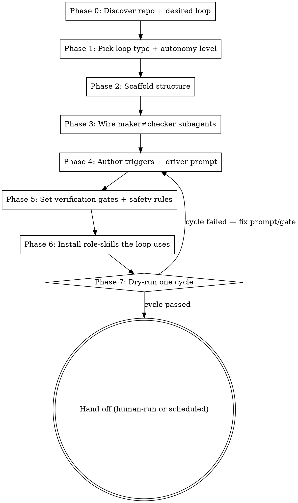

# Loop Engineer

Loop engineering is the practice of replacing yourself as the constant prompt-writer with a **system** that prompts, checks, records state, and decides what happens next. This skill builds that system.

It moves the developer up one level — from manually prompting every step to designing the loop that coordinates the work:

```
Manual:  Dev prompts → Agent responds → Dev reviews → Dev prompts again
Loop:    Automation discovers → Agent executes → Verifier checks → State updates → Loop decides next → Dev reviews only what matters
```

**Output:** a scaffolded loop system inside the target repo — state files, maker≠checker subagents, trigger/automation prompts, a driver prompt the loop-agent runs each cycle, verification gates, and `AGENTS.md` safety rules — tailored to what the repo actually is. **Not** a one-off code change.

**Core principle:** earn autonomy. Start at the smallest loop that delivers value (triage-only), prove it, then add execution, isolation, and connectors one layer at a time. Never scaffold a "fully autonomous, improve-the-codebase" loop on day one.

## Two layers — read this before you start

Keep these straight, exactly as in [optimization-loop](../optimization-loop/SKILL.md):

1. **Layer 1 (the process YOU run now)** — discover, choose the loop, scaffold files, wire agents, set gates, hand off. You perform these steps.
2. **Layer 2 (text that goes INTO the system)** — everything inside the template fences in the reference files: driver prompts, subagent instructions, automation prompts, `AGENTS.md` rules. You *author* this text; you do not perform it. A separate **loop-agent** runs it later, cycle after cycle.

When a template reads in the imperative ("Read the state file", "Run the suite", "Open a PR"), that's Layer 2 — written for the future loop-agent, not for you now.

## Persistence — required vs. optional

The **state files** (`agent-state/`) are the REQUIRED restart mechanism; the loop works with nothing else. **MemBerry** (a Neo4j knowledge-graph MCP server) is an OPTIONAL adapter that adds cross-session *learning* on top. If no MemBerry tools exist in the environment, skip every step labelled **(MemBerry)** and rely on the files alone — the loop is fully functional without it. State files track *what's done*; MemBerry remembers *what was learned*.

## Agent-agnostic by default

A loop is a pattern, not a product. Every artifact this skill scaffolds is provided in portable form. Subagents ship as **both** Claude Code (`.claude/agents/*.md`) and Codex (`.codex/agents/*.toml`); triggers map to whatever the host offers (cron, scheduled tasks, `/loop`, `/goal`, hooks, GitHub Actions). Detect the host, scaffold the matching primitives, and keep the state files / `AGENTS.md` / driver prompt host-neutral so the loop survives a platform switch. See [references/loop-architecture.md](references/loop-architecture.md) for the primitive-to-platform map.

## When to Use

- The user is repeatedly hand-prompting the same multi-step cycle (triage, fix, review, release) and wants it to run itself.
- Work needs to be *discovered* (CI failures, open issues, TODOs, stale branches) before it can be done.
- Multiple agents will touch the repo and need isolation + a maker≠checker split.
- The user wants scheduled / unattended / semi-autonomous execution with human review only at the merge gate.

## When NOT to Use

- A single one-off task or one specific bug — just do it (use **bugfix** / **bug-fixer**).
- An audit→fix→measure hardening pass on an existing codebase — use **optimization-loop** (a specialized loop; this skill can scaffold it as the execution stage).
- A brand-new codebase with nothing to loop over yet — use **brainstorming** / **writing-plans** first.

## The loop architecture (six parts)

Every loop this skill builds has the same spine. Full detail, the runtime DOT graph, and the maker≠checker rationale live in [references/loop-architecture.md](references/loop-architecture.md):

```
1. Trigger       → what starts a cycle (schedule, event, manual, /loop)
2. Discovery     → find work (CI, issues, TODOs, commits) → write to inbox
3. Planning      → pick ONE small, verifiable task for this cycle
4. Execution     → the maker agent does the work (in an isolated worktree)
5. Verification  → a SEPARATE checker agent gates it (tests, rules, scope)
6. State update  → record result, next action; commit code + state together
```

## The Process (Layer 1 — what you run now)



### Phase 0 — Discover

Find out what the repo is and what loop the user actually needs. Read entry points, test/lint/build/typecheck commands, CI config, issue tracker, branch conventions, and the host platform (Claude Code? Codex? both? CI-only?). Identify the verification commands the loop will gate on — **a loop with no runnable verification is not a loop, it's a hope.** If MemBerry is available, `berry_load` prior context first (skip if not).

### Phase 1 — Pick loop type + autonomy level

Name the loop in one narrow sentence ("every morning, triage new CI failures and open bugs into an inbox"). Bad loops have vague jobs ("improve the codebase"); good loops have one job. Then pick the **lowest** autonomy level that delivers value and let the loop earn its way up — the four-level ladder (triage-only → isolated implementation → connector integration → semi-autonomous) is in [references/loop-architecture.md](references/loop-architecture.md). Default new loops to Level 1 (triage-only, no code writes).

### Phase 2 — Scaffold structure

Create the skeleton. Run the scaffolder, or build it by hand from the templates:

```
python scripts/scaffold-loop.py --loop-name <name> --repo <path>
```

`--repo` is the target repo root (created if absent). It creates `agent-state/` (the loop's spine), agent + skill directories, `AGENTS.md`, and a starter driver prompt at `docs/prompts/<name>-driver.md` — idempotent, never overwrites existing files. Then enrich the state files from [references/state-templates.md](references/state-templates.md) (`loop-state.md`, `triage-inbox.md`, `completed.md`, `failed-attempts.md`, `decisions.md`). The state file is what makes the loop **restartable** — without it every run starts cold.

### Phase 3 — Wire maker≠checker subagents

The single most important rule: **the agent that wrote the code is never the only agent that verifies it.** Scaffold distinct roles — explorer, implementer, verifier, and (when auth/secrets/permissions are in scope) security-reviewer — from [references/subagent-templates.md](references/subagent-templates.md), in the host's format (Claude Code `.md` and/or Codex `.toml`). The verifier's job is not to be agreeable; it's to decide whether the change is actually correct, with evidence.

### Phase 4 — Author triggers + the driver prompt

Write the automation/trigger prompt (narrow job, no scope creep) and the per-cycle **driver prompt** the loop-agent executes. Templates and the platform-primitive map are in [references/automation-templates.md](references/automation-templates.md). The driver prompt walks the six-part spine for one cycle and ends by updating state.

### Phase 5 — Set verification gates + safety rules

Define the hard stops every cycle must clear (tests pass, lint/typecheck clean, no unrelated files changed, no secrets added, no tests deleted/skipped, state updated). Write the repo's `AGENTS.md` default rules. Both are templated in [references/safety-and-gates.md](references/safety-and-gates.md). Encode the gate as a `/goal`-style done condition where the host supports it.

### Phase 6 — Install role-skills the loop uses

The loop references per-job skills so agents don't rediscover the repo every cycle. Drop the ones the loop needs into the repo's `skills/` from [references/role-skills/](references/role-skills/) (triage, code-review, release) and adapt them to the repo's real commands and conventions.

### Phase 7 — Dry-run one cycle, then hand off

Run exactly one cycle end-to-end (preferably in a worktree — see [references/worktree-isolation.md](references/worktree-isolation.md)): trigger → discover → plan → the maker does a real task → the checker gates it → state updates. If the cycle can't complete or the gate is wrong, fix the prompt/gate and re-run — do not hand off a loop that has never closed once. Then hand off: tell the user how to run it on their host (manual `/loop`, scheduled task/cron, or CI) and remind them what they still own (architecture, merge decisions, security boundaries, cost, final accountability — the loop discovers/drafts/tests/summarizes; the human decides what ships).

## Before handoff — verify

Run this gate on your own output before presenting the scaffolded loop. Fix any failure first.

- [ ] The loop's job is one narrow sentence, not "improve the codebase."
- [ ] `agent-state/` exists with a populated `loop-state.md` carrying the current objective and verification commands.
- [ ] Maker and checker are **separate** agents; the checker requires evidence and can reject.
- [ ] Every gate is a runnable command that exits 0/1 — no "looks good" gates. The verification commands were confirmed to actually run in this repo.
- [ ] `AGENTS.md` exists with the default safety rules (no deleting tests to pass, record failed attempts, smallest diff).
- [ ] Subagents/triggers are in the host's real format (and portable form noted if the host may change).
- [ ] The autonomy level is the lowest that delivers value; the path to raise it is written down.
- [ ] One full cycle was dry-run and closed successfully.

## Specialized loops this skill can scaffold

- **optimization-loop** — for an audit→fix→measure→track hardening pass on an existing codebase. It builds natively on this skill's conventions (agent-state spine, driver at `docs/prompts/`, maker≠checker verifier, the scaffolder) and adds the optimization-specific machinery: intent discovery, an audit-derived backlog + metric vector, a no-regression ratchet, dual-mode cycles, and metric-driven termination — then wires the trigger and closes cycle 1 itself. When the user's loop IS optimization, invoke it directly; it hands off a running loop.
- **bug-pipeline** — the Hunter → Fixer → Validator defect pipeline over a shared tracker; same relationship.

## Common Mistakes

- **Skipping the maker≠checker split.** One agent grading its own homework approves plausible-but-wrong work. The checker must be separate and adversarial.
- **A loop with a vague job.** "Every morning, improve things" produces churn. Narrow the job to one discoverable, verifiable cycle.
- **No state file.** Without persistent state a restarted loop re-does finished work and loses discoveries. The file takes minutes and saves hours.
- **Jumping straight to full autonomy.** Scaffold triage-only first, earn each higher level. Autonomy is granted by evidence, not assumed.
- **Soft gates.** "Tests should pass" is not a gate. A gate is a command that exits non-zero and stops the cycle.
- **No isolation.** Parallel agents on one working tree corrupt each other. One task per worktree per branch.
- **Forgetting the human owns the merge.** The loop opens the PR; the developer still decides what ships.

---

**Guiding principle:** build the loop like someone who still intends to be the engineer. Every gate, isolation boundary, and human-owned decision exists so you can trust the loop without abdicating to it — it removes the repetitive prompting, not your judgment.
