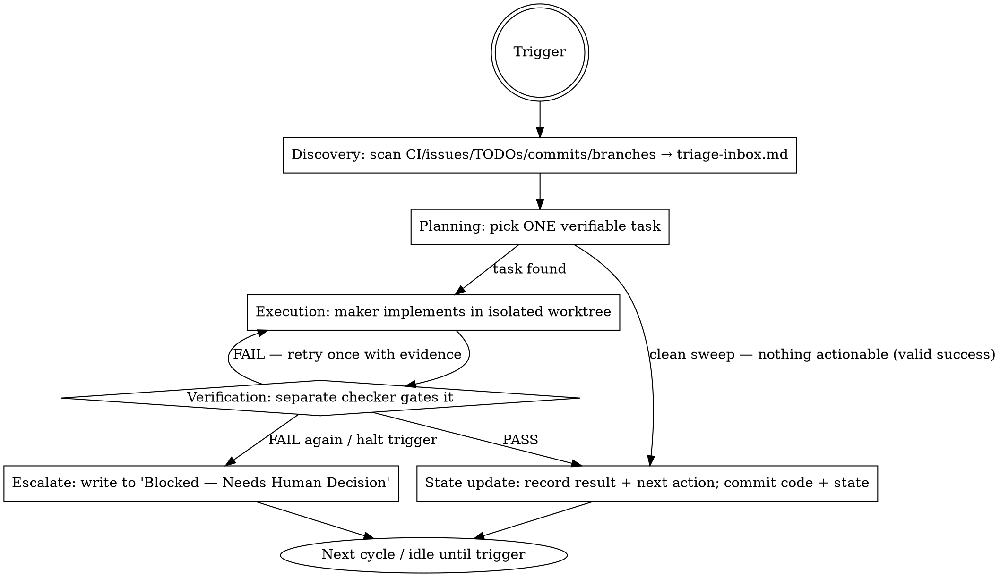

# Loop Architecture — the loop's runtime

The conceptual reference for what the loop **is** once it runs: where its artifacts live, the six-part spine each cycle walks, the maker≠checker rule, the autonomy ladder you climb with evidence, the primitive-to-platform map, and when a cycle ends or the loop-agent must stop and ask.

Everything here describes **Layer 2** — the system that runs cycle after cycle. You (Layer 1) build it; the **loop-agent** runs it. Template bodies in the sibling files are written in the imperative for that loop-agent, not for you scaffolding now.

Companion references:

- [../references/state-templates.md](../references/state-templates.md) — the `agent-state/` files
- [./subagent-templates.md](./subagent-templates.md) — explorer / implementer / verifier / security-reviewer bodies (Claude Code `.md` + Codex `.toml`)
- [./automation-templates.md](./automation-templates.md) — trigger prompts + the per-cycle driver prompt
- [./safety-and-gates.md](./safety-and-gates.md) — `AGENTS.md` rules + runnable gates
- [./worktree-isolation.md](./worktree-isolation.md) — one task per worktree per branch
- [./role-skills/](./role-skills/) — per-job skills the loop installs so agents don't rediscover the repo
- [../../optimization-loop/SKILL.md](../../optimization-loop/SKILL.md) — the specialized audit→fix→track loop this skill can scaffold as the execution stage

---

## 1. Recommended repo structure

A loop leaves a predictable footprint. The state files are the spine; everything else hangs off them. Scaffold both `.claude/agents/` and `.codex/agents/` so the loop survives a host switch — keep `agent-state/`, `AGENTS.md`, and the driver prompt host-neutral.

```
<repo>/
├── agent-state/                  # REQUIRED — the loop's restartable spine (host-neutral)
│   ├── loop-state.md             # current objective, autonomy level, verification commands, next action
│   ├── triage-inbox.md           # discovery output: candidate work, unassigned, one cycle's findings
│   ├── completed.md              # done items with commit SHAs (authoritative "what's finished")
│   ├── failed-attempts.md        # what was tried and why it failed — never re-attempt blindly
│   └── decisions.md              # choices made + rationale + "Blocked — Needs Human Decision" list
├── skills/                       # role-skills the loop uses (codified project knowledge)
│   └── <role>/
│       └── SKILL.md              # e.g. triage/SKILL.md, code-review/SKILL.md, release/SKILL.md
├── .claude/
│   └── agents/                   # Claude Code subagents
│       ├── explorer.md
│       ├── implementer.md
│       ├── verifier.md
│       └── security-reviewer.md  # only when auth/secrets/permissions are in scope
├── .codex/
│   └── agents/                   # Codex subagents (same roles, TOML)
│       ├── explorer.toml
│       ├── implementer.toml
│       ├── verifier.toml
│       └── security-reviewer.toml
├── AGENTS.md                     # host-neutral default safety rules every agent obeys
├── docs/
│   └── prompts/
│       └── <loop>-driver.md      # the per-cycle driver prompt the loop-agent runs each cycle
└── README.md                     # how a human runs the loop on their host + what they still own
```

The state files track *what's done*. **(MemBerry)** when present, it remembers *what was learned* across sessions — an optional adapter, never the restart mechanism. Skip every **(MemBerry)** step when no MemBerry tools exist in the environment; the files alone keep the loop fully functional.

---

## 2. The six-part loop architecture (runtime spine)

Every loop walks the same six parts each cycle. The driver prompt is just this spine, specialized to the repo.

1. **Trigger** — what starts one cycle: a schedule (each morning), an event (CI failed, issue opened), or a manual kick (`/loop`). One trigger fires one cycle.
2. **Discovery** — find work without doing it: scan CI failures, open issues, `TODO`/`FIXME` comments, recent commits, and stale branches. Write every candidate to `agent-state/triage-inbox.md`. Discovery never writes code.
3. **Planning** — read the inbox and pick exactly **ONE** small, verifiable task for this cycle. If nothing clears the bar, that's a clean discovery cycle — a valid success, not a failure.
4. **Execution** — the **maker** agent (implementer) does the one task in an **isolated worktree** (see [./worktree-isolation.md](./worktree-isolation.md)) — one task, one branch, smallest diff that works.
5. **Verification** — a **SEPARATE** checker agent (verifier) gates the change against tests, rules, scope, and acceptance. It can **REJECT** with evidence. The maker never self-certifies.
6. **State update** — record the result in `completed.md` (with SHA) or `failed-attempts.md`, set the next action in `loop-state.md`, append the decision/block to `decisions.md`, then **commit code and state together** so a restart never sees a committed-but-unrecorded change. **(MemBerry)** store the cycle's root cause/convention if available.

### Worked example flow

> A scheduled automation runs each morning → reads open issues, the latest CI run, and the last day's commits → writes the candidates to `triage-inbox.md` → planning picks one failing-test issue and assigns it to the implementer in a fresh worktree → the implementer fixes it and runs the suite → the verifier independently re-runs the gate and reviews the diff for scope creep → on pass, `completed.md` gets the item + SHA and `loop-state.md` points at the next action → code and state commit together. On reject, the item goes back to the implementer with the verifier's evidence, or escalates to the block list after a second failure.

### Runtime DOT graph (one cycle)



---

## 3. Maker ≠ Checker

**The rule:** the agent that wrote the code is never the only agent that verifies it. One agent grading its own homework approves plausible-but-wrong work; a separate, adversarial checker is the loop's only defense against that.

The four roles and their one-line jobs:

| Role | Job |
|---|---|
| **Explorer** | Finds the problem — reads code, traces the data path, summarizes options. Writes findings, not fixes. |
| **Implementer** | Makes the change — the maker. One task, isolated worktree, smallest diff. |
| **Verifier** | Checks the change against tests, rules, scope, and acceptance. **Can REJECT.** Not agreeable — its job is to decide whether the change is actually correct, with evidence. |
| **Security-reviewer** | Checks auth, permissions, secret handling, injection, and dangerous side effects. **Include only when those are in scope** (auth changes, new endpoints, secret access, shelling out). |

**Run the checker on a different model/provider than the maker where possible.** Same model, same brain, same blind spots — a cross-provider checker (e.g. maker on one provider, verifier on another) catches what the maker can't see in itself. Bodies for all four roles, in both Claude Code `.md` and Codex `.toml`, are in [./subagent-templates.md](./subagent-templates.md).

---

## 4. The autonomy ladder (and the minimum viable loop)

Two ideas live here, kept separate. The **minimum viable loop** is the smallest runnable end-to-end cycle — the four spine stages *plan → make → check → record*; you always run the whole minimal loop. The **autonomy ladder** (Level 1–4 below) is how much of that loop runs *unattended* before a human looks. You raise the ladder one rung at a time; you never shrink the loop below its minimal four stages.

Start at the smallest loop that delivers value and **earn** each higher level with evidence from the one below. **Never start above Level 1.** A new loop is triage-only until it proves its discovery is trustworthy.

| Level | What it adds | Promotion criterion (earned, with evidence) |
|---|---|---|
| **1 — Triage-only** *(default for a new loop)* | Automation discovers work and writes to `triage-inbox.md`. A human reviews. **NO code writes.** | Several cycles where the inbox findings were real and actionable — the human kept, not discarded, the triage. |
| **2 — Isolated implementation** | A human approves a specific task → the implementer works in a worktree → the verifier checks → the human reviews the diff. | A run of approved tasks where the verifier's pass/reject matched the human's judgment and the diffs stayed in scope. |
| **3 — Connector integration** | The loop reads issues/CI, updates the tracker (Linear/GitHub), opens a PR, and pings Slack — wired into the team's tools. | Connector actions were correct and well-scoped: right issues touched, clean PRs, no noisy or wrong notifications. |
| **4 — Semi-autonomous** | The loop discovers **low-risk** work on its own, implements it in a worktree, the verifier checks, and a PR is opened for human review. | Sustained Phase-3 reliability plus a low false-positive rate on what the loop self-selects as "low-risk." |

Each rung depends on the one below: you don't grant connector write-access to a loop whose triage you don't yet trust, and you don't let it self-select work until its supervised implementation is reliable. The human always owns the merge — even at Level 4 the loop opens the PR; the human decides what ships.

---

## 5. Primitive-to-platform map

A loop is a pattern, not a product. Each primitive maps to whatever the host offers. Scaffold the matching column for the detected host; keep state files / `AGENTS.md` / the driver prompt host-neutral so a platform switch doesn't break the loop.

| Primitive | Codex | Claude Code | Generic / CI |
|---|---|---|---|
| **Automations** (discovery / triage / scheduled) | Automations tab + `/goal` + Triage inbox | Scheduled tasks / cron + `/loop` + `/goal` + hooks + GitHub Actions | Cron / CI scheduler |
| **Worktrees** (isolation) | Built-in worktree per thread | `git worktree` / `--worktree` | `git worktree` |
| **Skills** (codify project knowledge) | `SKILL.md` | `SKILL.md` | `SKILL.md` / `AGENTS.md` |
| **Plugins / connectors** (MCP + plugins) | MCP connectors | MCP servers | Any MCP / REST |
| **Subagents** (ideate / implement / verify) | TOML agents in `.codex/agents/` | Agents in `.claude/agents/` | Any subagent framework |
| **State** (track what's done) | `agent-state/` markdown files | `agent-state/` markdown files | Markdown state files |

---

## 6. Stopping & escalation

**When one CYCLE ends (success):**

- Task done **and** the gate is green **and** state is written and committed — or
- A clean discovery sweep where **nothing cleared the bar**. An empty actionable inbox is a valid, successful cycle. Never manufacture work to look busy.

**The heuristic for autonomy inside a cycle:** *expensive-to-reverse guess → stop and ask; cheap-and-obvious → proceed and log.* The loop-agent proceeds on reversible, low-stakes decisions and records them; it stops on anything costly to undo.

**Halt triggers — the loop-agent must STOP and ask the human when the task would:**

- change a public API, schema, config contract, or on-disk/serialization format;
- delete or rewire code referenced **outside** its own module;
- make tests pass only by changing their expectations (no intent-doc justification);
- span multiple sessions in scope; or
- rest on genuinely ambiguous intent.

A halt is not a dead end. The loop-agent writes the item to the **"Blocked — Needs Human Decision"** list in `agent-state/decisions.md` **(MemBerry)** and to `open_questions` if available — then **continues other work**. One blocked item never stalls the whole loop. When the verifier rejects twice, or a halt trigger fires, the item escalates to that list and the cycle moves on or ends cleanly.

For the audit→fix→track variant of this stopping discipline (CONVERGED / STALLED / DIVERGING termination over a tracked metric vector), see [../../optimization-loop/SKILL.md](../../optimization-loop/SKILL.md), the specialized loop this skill can scaffold as the execution stage.
