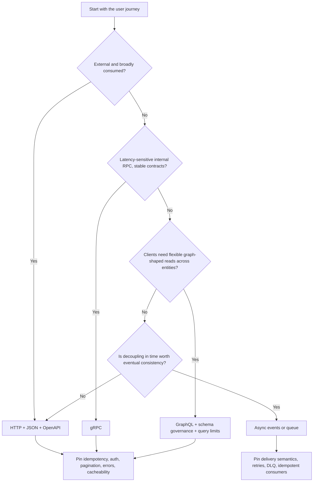

# API playbook

Decision tree, failure-mode table, metrics, and assessment prompts for [api-design](../SKILL.md).

## Protocol decision tree



## Contract package template

Use this before implementation or review. Missing rows are contract gaps.

```md
# API contract: <surface>

## Protocol decision
Chosen protocol: <HTTP/gRPC/GraphQL/events>
Reason: <consumer shape, latency, coupling, governance>
Rejected alternatives: <why not>

## Operation matrix
| Operation | Caller / trust boundary | Request schema | Response schema | Side effect | Auth scope | Deadline | Retry / idempotency | Rate limit | Cacheability | SLI |
|---|---|---|---|---|---|---|---|---|---|---|

## Error envelope
~~~json
{
  "code": "STRING_ENUM",
  "message": "safe user-facing message",
  "correlation_id": "uuid",
  "retryable": false,
  "details": {}
}
~~~

## Compatibility and release gate
| Check | Evidence | Verdict |
|---|---|---|
| Backward-compatible schema diff |  | pass/fail |
| Idempotency reviewed for retried writes |  | pass/fail |
| Abuse and resource limits reviewed |  | pass/fail |
| Contract conformance tests added |  | pass/fail |
| Observability fields/dashboards defined |  | pass/fail |
```

## Failure modes → mitigations

| Failure | Mechanism | Mitigation |
|---|---|---|
| Retry storm | Retries stacked at client + gateway + mesh, no budget | One retry owner; budgets; backoff + jitter; circuit breaker |
| Duplicate side effects | Auto-retry of non-idempotent POST | Idempotency keys stored with the result; safe replay returns the original outcome |
| Tail-latency fan-out | N+1 resolvers / wide fan-out, p99 compounds | Batching, dataloaders, tighter per-call deadlines, hedging only with budgets |
| Rate-limit bypass | Limits keyed on the wrong principal | Limit per authenticated principal + per IP; deny by default on anonymous writes |
| Unsafe error handling | Stack traces / internal details in responses | One error schema; correlation id; details to logs, not clients |
| Schema drift | Hand-edited docs diverge from behavior | Contract-first: the OpenAPI/proto/SDL is the source; CI validates conformance |

## Metrics to design in

Four golden signals (latency, traffic, errors, saturation) **plus**: request size, auth-failure rate, retry rate, worker-pool saturation, cache-hit ratio on cacheable endpoints, deprecated-field usage (tells you when a version can die).

## Idempotency recipe (side-effecting endpoints)

1. Client sends `Idempotency-Key: <uuid>` with the write.
2. Server stores `{key → result}` atomically with the side effect (same transaction / outbox).
3. Replays with the same key return the stored result — no re-execution.
4. Keys expire on a documented window; document it in the contract.

## Multi-service write patterns

- **Transactional outbox** — write the row + the event in one transaction; a relay publishes. Use when one service owns the write and others must hear about it.
- **Saga** — sequence of local transactions with compensations. Use when a workflow spans owners. Each step idempotent; compensation tested, not theoretical.
- Never: two-phase commit across microservices you don't co-own, or "call service B and hope" inside a transaction.

## Assessment prompts (design-review questions)

- When is GraphQL *harmful* compared with REST? (One client, cache-heavy reads, no schema governance capacity.)
- How would you make a POST endpoint safe to retry? (Idempotency key + stored result + atomic write.)
- Why can a deadline be more protective than a retry? (It bounds queue residence; retries add load.)
- What makes "exactly once" usually a workflow property, not a broker setting? (Dedup/idempotency at the consumer completes what delivery guarantees can't.)
