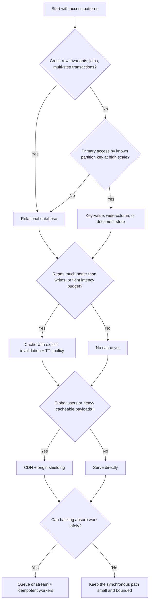

# Data playbook

Decision tree, key-design rules, per-layer patterns/metrics/failure modes for [data-store-selection](../SKILL.md).

## Decision tree — data, cache, and scale



## Data design package template

Use this before product names. Any blank in consistency, ownership, or key justification is a blocker.

```md
# Data design: <system>

## Access-pattern matrix
| Pattern | Read/write | Shape | Rate / peak | Latency budget | Cardinality | Invariants |
|---|---|---|---:|---:|---:|---|

## Data-class consistency
| Data class | Source of truth | Required consistency | Acceptable staleness | Conflict behavior | Retention / deletion |
|---|---|---|---|---|---|

## Store and key plan
| Store | Data owned | Schema / aggregate | Partition or shard key | Query path justified | Failure / recovery path |
|---|---|---|---|---|---|

## Cache contract
| Object | Owner | Source of truth | Invalidation | TTL | Staleness budget | Stampede protection |
|---|---|---|---|---|---|---|

## Queue / stream contract
| Topic / queue | Producer | Consumer | Delivery semantics | Ordering key | Retry / DLQ owner | Backlog freshness |
|---|---|---|---|---|---|---|

## Migration and backfill
| Step | Safety guard | Rollback / recovery | Verification |
|---|---|---|---|
```

## Relational layer

**Patterns:** normalized first, denormalize for measured hot paths; read replicas for read-heavy loads (mind replica lag vs read-your-writes); native partitioning for large time/key-bounded tables; transactional outbox for event publication; short transactions; online schema changes.
**Capacity:** size buffer cache to the hot working set; benchmark with production-like mixes — replication lag and lock contention arrive before CPU does.
**Metrics:** p95 query latency, slow-query rate, lock waits/deadlocks, buffer-cache hit ratio, WAL/binlog volume, replication lag, connection-pool saturation, disk IOPS.
**Failure modes → mitigations:** hot rows/long transactions → shorter transactions, queueing at app layer (`SKIP LOCKED`-style claim patterns); replica lag breaking read-your-writes → pin those reads to primary; migration risk → online changes + rehearsed rollback; failover gaps → tested restore + failover drills, not assumed ones.

## NoSQL families

- **Key-value / wide-column** (Dynamo/Bigtable lineage): extreme keyed scale, tunable consistency. Model around partition + sort keys; queries are designed, not ad-hoc.
- **Document**: aggregate-centric reads, flexible schema. Shard keys balance cardinality, frequency, monotonicity.
- **Global SQL** (Spanner lineage): synchronously replicated transactions, external consistency — pay for it only when the requirement is named.

**Key-design rules:** high cardinality · even access spread · aligned with the dominant query · never monotonic (bucket timestamps: `entity#yyyymmdd`) · uneven tenants get their own bucketing. Precompute views for fan-out reads instead of scatter-gather.
**Metrics:** partition skew / per-partition heat, read+write latency, storage growth, compaction/balancer activity, consistency errors.
**Failure modes → mitigations:** hot partitions → higher-cardinality or composite keys; scatter-gather queries → precomputed views; write amplification → fewer secondary indexes; consistency surprises → document read-your-writes expectations explicitly.

## Cache layer

**Patterns:** cache-aside (default) · write-through (warm on write path) · invalidation-on-write for freshness · TTL from business staleness budget, jittered · stampede protection: request coalescing, jittered expiry, stale-while-revalidate / stale-on-error.
**Metrics:** hit/miss ratio, eviction rate, memory fragmentation, key churn, command latency, replication health, origin offload.
**Failure modes → mitigations:** stampede after purge/expiry → coalescing + jitter; stale data → explicit invalidation tied to the write path; Redis-as-state without persistence → enable persistence/replication or don't store state there.
**Per-object contract (required):** owner · source of truth · invalidation mechanism · TTL · acceptable staleness.

## Queue / stream layer

| Choose | When |
|---|---|
| **Kafka-style log** | Ordered partitions, replay, high-throughput streams, multiple independent consumer groups. Partition count bounds consumer parallelism. |
| **RabbitMQ-style broker** | Work queues, routing flexibility, per-message acks/confirms, DLX, quorum queues. Prefetch + consumer capacity decide keep-up. |

**Always:** idempotent consumers · DLQ with an owner and review workflow · bounded retries with backoff · publisher confirms / outbox on the producer.
**Capacity:** backlog tolerance × ingest rate — not broker CPU. Backlog is a *feature* (absorbing bursts) until age-of-oldest-message breaches the freshness budget.
**Metrics:** queue depth, age of oldest message, consumer lag, publish/consume rates, ack failures, DLQ growth, rebalancing churn.
**Failure modes → mitigations:** poison messages → DLQ + bounded retries; duplicates → consumer idempotency keys; consumer overload → backpressure/prefetch tuning; "lost" messages → confirms + outbox, never fire-and-forget.

## Assessment prompts

- Why can a new index make writes slower? (Every write now maintains it.)
- When does partitioning beat sharding? (Same-node management of bounded big tables vs. horizontal write scale.)
- Why is a good shard key more important than the database brand? (It decides heat distribution — the actual bottleneck.)
- When is backlog a feature instead of a bug? (Burst absorption within the staleness budget.)
