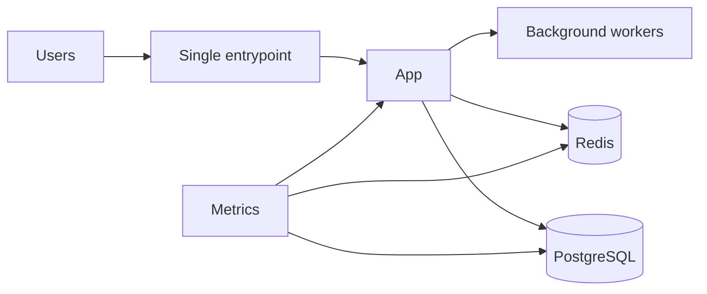
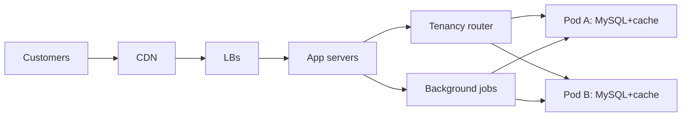
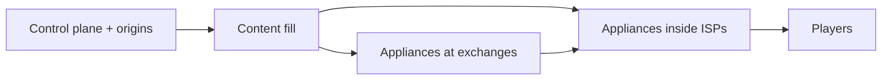

# Defaults by scale & case studies

Reference tables and worked topologies for [design-system](../SKILL.md). Cloud-agnostic synthesis — the *shape* is the lesson, not the vendor names.

## Recommended defaults by scale

| Scale profile | Architecture | Data | Edge | Ops |
|---|---|---|---|---|
| Small team, modest traffic | Modular monolith | PostgreSQL | CDN + managed L7 LB + Redis cache | Simple CI/CD, basic SLOs, OTel + Prometheus-style metrics |
| Growing product, mixed traffic | Modular monolith or a few services | Relational primary + replicas; selective NoSQL for proven patterns | CDN + L7 LB + Redis cluster + background jobs | GitOps or disciplined CD, canaries, runbooks, DLQ workflows |
| Large / global platform | Decompose only where a scaling boundary justifies it | Polyglot with explicit consistency zones | Multi-tier CDN, regional/global LB, aggressive origin shielding | SLO automation, mesh selectively, incident command, capacity + cost management |

## Edge & resilience defaults

| Problem | Default | Alternative | Caution |
|---|---|---|---|
| Repeated hot reads | Cache-aside (Redis/Memcached) | Write-through | Invalidation must be explicit |
| Global static/cacheable delivery | CDN, immutable assets, purge-by-URL | Edge compute only where necessary | Bad cache keys ruin hit ratio |
| Uneven backend load | L7 LB + health checks | L4 when protocol simplicity wins | Layered retries amplify incidents |
| Slow downstream dependency | Timeouts + retry budget + circuit breaker | Retry-only | Retry alone worsens overload |

## Case study shapes

### Small — one well-shaped server (GitLab ≤1k users)

~20 peak API RPS runs on a single server: app + workers + PostgreSQL + Redis + storage + Prometheus. Lesson: keep compute and data together at modest scale; split stateful services out only when **measured** demand requires it.

Anti-pattern this kills: importing large-scale patterns before the workload created the bottleneck.

### Medium — growth by isolation (Shopify pods)

Tenants isolated into pods, each pod a fully isolated datastore set; shared app servers/job workers/LBs talk to one pod at a time. Scaling came from tenancy isolation, query work (`SKIP LOCKED` redesigns), memoization, write-through caching for hot feeds, background jobs — **not** a microservice explosion. Lesson: model the bottleneck precisely; isolate failure domains.

This is the right stage for sharding, read/write split, outbox, per-pod incident containment.

### Large — topology as the design variable (Netflix Open Connect)

A purpose-built CDN: content placed in appliances at exchanges and *inside ISP networks*, filled off-peak, peered directly — moving hot bytes next to users and shrinking upstream demand by orders of magnitude. Lesson: at global scale, **network topology and data placement are first-order design variables**; the question isn't "more microservices?" but "how do I move hot bytes and hot decisions closer to users while protecting the control plane?"

## The additive teaching order

Modular monolith + relational DB → Redis-style cache → CDN → read replicas → background jobs → *then* service decomposition → async eventing → mesh features. Each step is added by a measured need, never by fashion.
