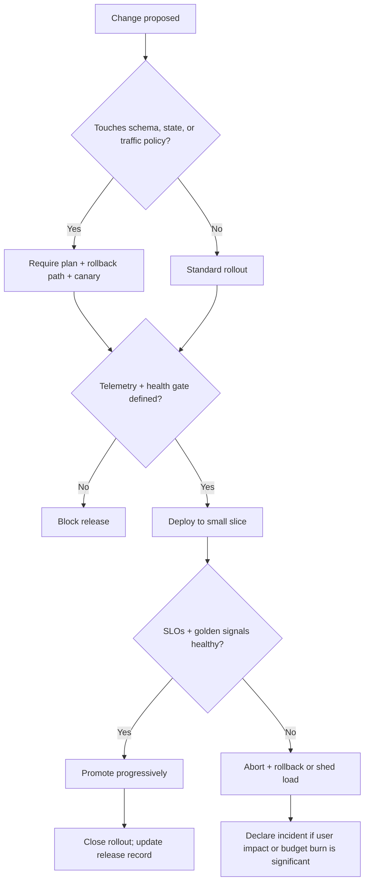

# Readiness playbook

Templates for [production-readiness](../SKILL.md): runbook skeleton, incident card, deployment decision tree, SLO worksheet, postmortem template.

## SLO worksheet

1. Per user journey, pick the SLI: availability (good requests / total), latency (p95/p99 under X ms), correctness/freshness where it's the product.
2. Set the SLO from user tolerance + business need — not from current performance (that just enshrines today).
3. Error budget = 1 − SLO over the window (99.9%/30d ≈ 43m of burn).
4. Budget policy — write the actual rules: burn rate > X → freeze risky launches; budget healthy → ship faster. Alert on burn *rate* (fast-burn page, slow-burn ticket), not raw error count.

## Readiness package template

Use this as the launch review artifact. Unknowns are blockers until replaced with URLs, commands, owners, or drill evidence.

```md
# Readiness review: <service>

## Verdict
Status: ready / ready after fixes / not ready
Smallest fix list:
- <fix>

## SLOs and error budget
| Journey | SLI | SLO | Window | Fast-burn alert | Slow-burn ticket | Budget policy |
|---|---|---:|---|---|---|---|

## Dashboards and alerts
| Signal | Dashboard URL | Alert route | Page? | Runbook |
|---|---|---|---|---|

## Probes and deployment
| Control | Current setting | Failure behavior | Evidence |
|---|---|---|---|
| Liveness |  |  |  |
| Readiness |  |  |  |
| Startup |  |  |  |
| Canary gate |  |  |  |
| Rollback command |  |  | tested <date> |

## Failure drills
| Drill | Ran when | Result | Follow-up |
|---|---|---|---|

## Cost and capacity
| Resource | Current load | Limit / budget | Risk |
|---|---:|---:|---|
```

## Runbook skeleton (one per failure mode)

```md
# Runbook: <service> — <failure mode>
Owner: <team/person>   Escalation: <next>   Dashboard: <URL>   SLO impact: <which, how fast>
## Symptoms (what pages / what users see)
## First checks (fast, safe, read-only — with commands)
## Safe mitigations (reversible first: rollback / traffic shift / rate-limit / serve-stale / feature off)
## Rollback steps (exact commands; tested <date>)
## Evidence to capture (for the postmortem)
```

Write these five before launch: dependency outage · database failover · cache failure · queue backlog · bad deploy.

## Incident response card

1. Confirm user impact + SLO burn → severity.
2. Assign **incident lead** + **comms lead** (the lead coordinates, doesn't type).
3. Freeze unrelated changes.
4. Timeline + likely blast radius.
5. **Safest reversible mitigation first** — reduce load and preserve correctness over preserving all functionality.
6. Capture evidence as you go (commands, graphs, timestamps).
7. Restore safely; verify with the SLI, not vibes.
8. Blameless postmortem within <N> days.

## Deployment safety decision tree



Release record fields: artifact version · migration status · canary scope · rollback command · success criteria.

## Probe semantics

| Probe | Question | On failure | Pitfall |
|---|---|---|---|
| Liveness | Am I wedged? | Restart container | Probing dependencies → restart storms |
| Readiness | Can I take traffic? | Remove from rotation | Not reflecting dependency readiness → routed-to-while-broken |
| Startup | Still booting? | Hold other probes | Missing on slow boots → kill-loop at deploy |

## Telemetry hygiene

- Histograms over client-side summaries for shared percentiles; buckets shaped around the SLO threshold.
- Bounded label sets — service, route-template, method, code. **Never** user IDs, emails, raw URLs.
- Recording rules for expensive queries; retention tiers by investigation need (metrics long, traces sampled, logs tiered).
- Correlate telemetry with deploy + incident metadata (version label on every signal).
- Monitor the platform itself: scrape success, ingestion rate, dropped spans, query latency.

## Postmortem template

```md
# Postmortem: <incident> — <date>   (blameless)
Impact: <users/journeys, duration, SLO burn>
Timeline: <detection → mitigation → resolution, timestamped>
Root cause: <the mechanism, not a person>
What went well / what hurt:
Action items: | action | owner | due | (every item owned AND dated)
```

## DORA + ops metrics to track

Deployment frequency · lead time · change-failure rate · MTTR — plus page volume per on-call shift, alert precision (pages that were real), toil hours, canary abort rate, rollback frequency. Deployment frequency is meaningless without the recovery metrics next to it.
